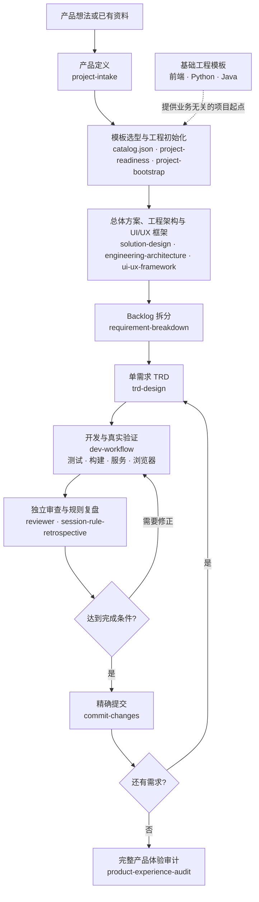

# PCM Agent Skills

PCM Agent Skills 是一组面向完整软件产品开发过程的 Claude Code Skills、Subagents 与项目规则。它从产品想法或已有资料出发，覆盖产品定义、工程准备、技术设计、需求拆分、开发验证、独立审查和 Git 提交收口。

每项能力可以独立调用；实际使用时根据项目现状、任务范围和风险选择需要的步骤，不要求所有项目机械执行同一条流程。

## 工作方式



这是一条推荐的人工协作路径：调用者负责根据项目事实组织步骤、传递上下文并作出必要决定。仓库提供能力与边界，不包含程序化自动编排器。

## 核心能力

| 类别 | 代表性能力 | 作用 |
|---|---|---|
| 产品与方案 | `project-intake`、`solution-design` | 收敛产品范围，确定系统边界与总体技术方向 |
| 工程准备 | `project-readiness`、`project-bootstrap`、`engineering-architecture` | 准备真实开发资源，将基础工程项目化并明确代码归属 |
| 体验框架 | `ui-ux-framework`、`tailwind-theme`、`media-assets` | 建立产品级界面框架，并按技术栈处理主题和媒体资源 |
| 需求设计 | `requirement-breakdown`、`trd-design` | 将产品范围拆成可执行需求，为单个需求形成活动 TRD |
| 开发与验证 | `dev-workflow`、`dev` Subagent | 完成实现，并以测试、构建、服务、数据和浏览器行为证明结果 |
| 质量收口 | `reviewer`、`product-experience-audit`、`session-rule-retrospective` | 独立审查变更，审计完整产品，并把真实经验沉淀为项目规则 |
| Git 交付 | `commit-changes` | 按功能结果精确暂存和创建本地提交 |

完整能力列表和职责边界见 [`.claude/README.md`](.claude/README.md)。

## 仓库结构

```text
.claude/
├── skills/       # 第一方 Skills
├── agents/       # 开发与只读审查 Subagents
├── rules/        # 可复用项目规则
└── README.md     # 能力目录与使用边界
AGENTS.md         # 通用 Agent 工作规范
CLAUDE.md         # Claude Code 项目入口
catalog.json      # 基础工程模板选择快照
```

## 模板体系

PCM 将开发能力和基础工程分开维护：

| 仓库 | 职责 |
|---|---|
| [`pcm-agent-skills`](https://github.com/andrszan/pcm-agent-skills) | Skills、Subagents、规则和模板选择快照 |
| [`pcm-template-projects`](https://github.com/andrszan/pcm-template-projects) | 模板体系的上层导航、准入规则和治理 |
| [`pcm-frontend-templates`](https://github.com/andrszan/pcm-frontend-templates) | Next.js、React/Vite、Vue/Vite 等前端基础工程 |
| [`pcm-python-templates`](https://github.com/andrszan/pcm-python-templates) | FastAPI + SQLAlchemy 后端基础工程 |
| [`pcm-java-templates`](https://github.com/andrszan/pcm-java-templates) | Spring Boot + MyBatis-Plus 后端基础工程 |

[`catalog.json`](catalog.json) 是供 Skills 使用的机器可读选择快照，只登记业务无关、可独立运行的前端和后端项目起点。模板提供工程基础，不预置客户业务；具体的数据模型、接口、权限、页面和部署方式仍由目标项目决定并验证。

## 使用方式

将能力目录和项目规则放入目标项目，再从当前任务需要的能力开始：

```bash
cp -R .claude /path/to/project/
cp AGENTS.md CLAUDE.md catalog.json /path/to/project/
```

使用前需要：

1. 合并而不是覆盖目标项目已有的贡献规范和安全规则；
2. 根据目标项目准备语言运行时、依赖、数据库、外部服务和受保护配置；
3. 只调用当前任务真正需要的 Skill；
4. 使用目标项目自己的测试、构建、服务、数据和浏览器环境验证结果；
5. 将 API key、token、密码、私钥和个人认证信息保留在 Git 忽略的受保护配置中。

Claude Code、Git 和目标项目自身工具是基本依赖。部分能力可以使用额外浏览器、媒体或文档工具，但这些工具不会由本仓库自动安装，缺失时必须如实保留验证缺口。

## 边界与许可

- 本仓库只发布 Agent 开发能力，不包含客户项目、真实产品资料、运行状态、凭据或自动编排实现。
- 第三方 Plugin 和通用第三方 Skills 不随仓库分发；需要时由使用者按各自来源和许可证独立安装。
- 本仓库未对第一方内容授予开源许可。保留的第三方参考资源继续遵循各自许可证，详见 [`THIRD_PARTY_NOTICES.md`](THIRD_PARTY_NOTICES.md)。
