# PCM Agent Skills

PCM 是 Project Customization & Management（项目定制与管理）的缩写。本仓库是 PCM 的内部开发管理、AI Agent 能力、产品开发流程和 `pcm-demo` 技术验证工作区。它不是客户产品仓库，也不是已经建成的正式 PCM Core 或对外商业平台。

每项能力可以独立调用；实际使用时根据项目现状、任务范围和风险选择需要的步骤，不要求所有项目机械执行同一条流程。

## 工作方式

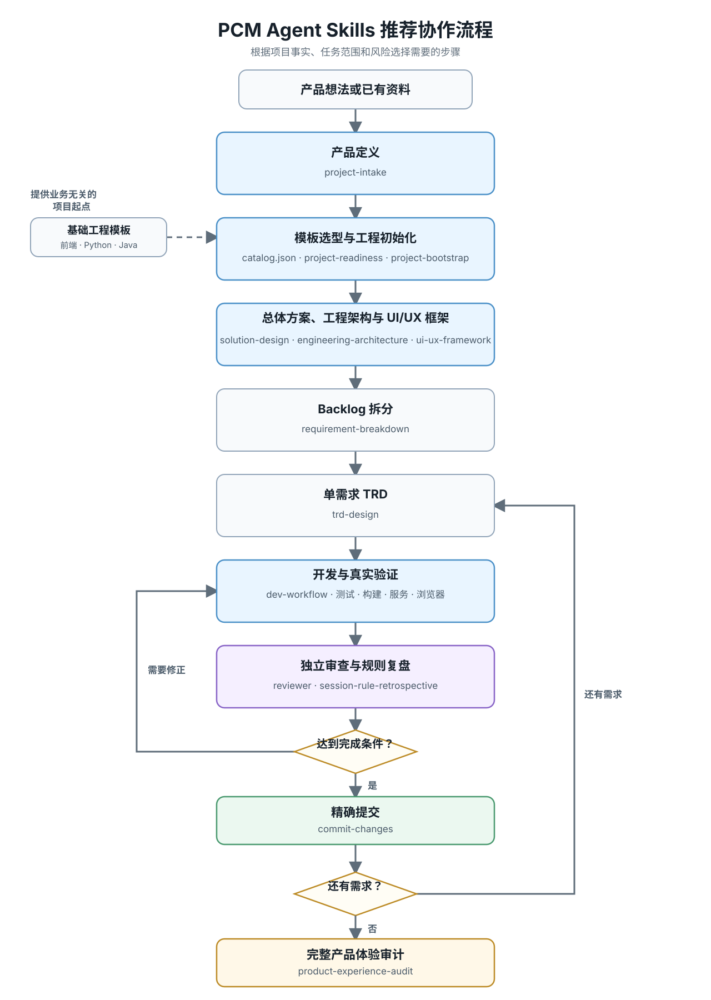

这是一条推荐的人工协作路径：调用者负责根据项目事实组织步骤、传递上下文并作出必要决定。仓库提供能力与边界，不包含程序化自动编排器。

## 核心能力

| 类别 | 代表性能力 | 作用 |
|---|---|---|
| 产品与方案 | `project-intake`、`solution-design` | 收敛产品范围，确定系统边界与总体技术方向 |
| 工程准备 | `project-readiness`、`project-bootstrap`、`engineering-architecture` | 准备真实开发资源，将基础工程项目化并明确代码归属 |
| 体验框架 | `ui-ux-framework`、`tailwind-theme`、`media-assets` | 建立产品级界面框架，并按技术栈处理主题和媒体资源 |
| 需求设计 | `requirement-breakdown`、`trd-design` | 将产品范围拆成可执行需求，为单个需求形成活动 TRD |
| 开发与验证 | `dev-workflow`、`dev` Subagent | 完成实现，并以测试、构建、服务、数据和浏览器行为证明结果 |
| 质量收口 | `reviewer`、`product-experience-audit`、`session-rule-retrospective` | 独立审查变更，审计完整产品，并把真实经验沉淀为项目规则 |
| Git 交付 | `commit-changes` | 按功能结果精确暂存和创建本地提交 |

完整能力列表和职责边界见 [`.claude/README.md`](.claude/README.md)。

## 自动化开发产品案例

以下产品由 PCM Agent Skills 的能力组合开发完成，涵盖从产品与需求设计到工程实现、验证和本地交付的完整过程。每个案例展示代表性界面和已交付的功能范围。

### 食序 MealFlow

面向个人、合住伙伴和家庭的饮食协作工具。用户先管理家中食材库存，再安排一周菜单、生成采购清单，并在烹饪后确认食材消耗，让家庭成员围绕日常饮食持续协作。

**功能模块：**

- **账号与家庭协作：** 注册登录、个人与通知偏好、家庭创建与切换、成员／访客邀请、角色授权、所有权转让和受规则约束的家庭删除。
- **库存与菜谱：** 按批次维护食材数量、位置、保质期和状态，追溯库存流水、设置阈值提醒；浏览、收藏、创建、复制和导入公共或家庭菜谱。
- **菜单与采购：** 按日期和餐次安排一周菜单，设置份数与负责人，基于库存生成短缺建议和购物清单，并支持常购模板、采购领取、购买登记、批量入库、打印和移动端购物模式。
- **烹饪与日常概览：** 预览并确认实际食材消耗、选择扣减批次、记录部分完成和有条件撤销；集中展示今日餐次、临期食材、采购待办与成员变化。
- **运营与通用体验：** 在权限范围内搜索、筛选和排序食材与菜谱，提供站内通知、邮件摘要、内容运营、平台治理、审计，以及桌面、平板和移动端统一反馈。

<table>
  <tr>
    <td width="32%" rowspan="3" valign="top">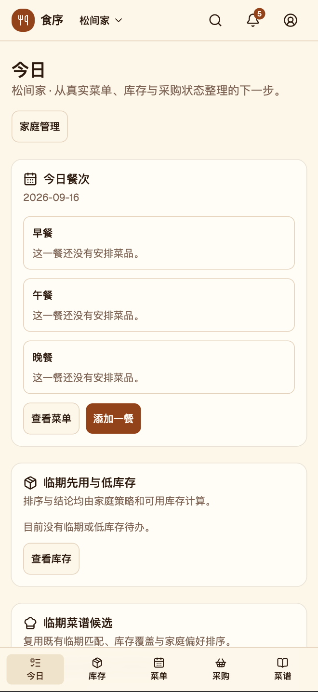</td>
    <td width="68%">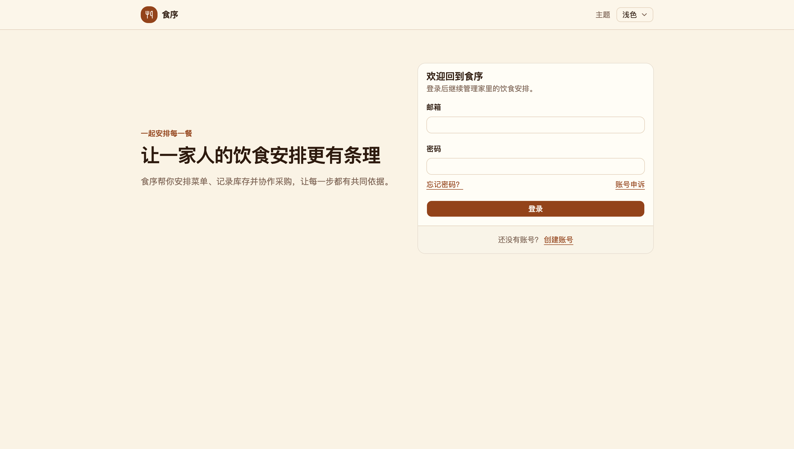</td>
  </tr>
  <tr>
    <td>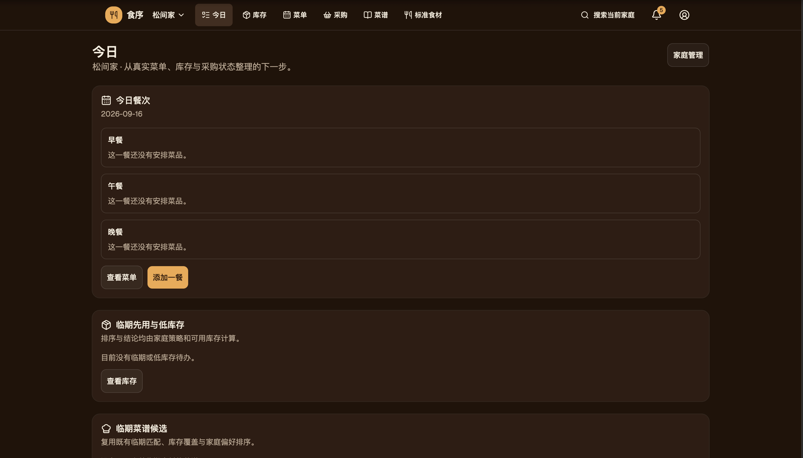</td>
  </tr>
  <tr>
    <td>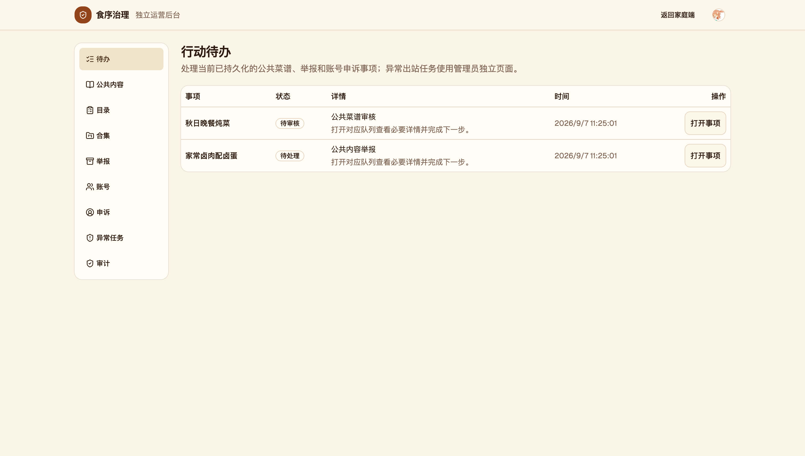</td>
  </tr>
</table>

### 尾屿 Tailisle

面向城市社区的宠物照护伙伴智能匹配系统。宠物主人可以发布照护需求、筛选和邀请合适的服务者，双方围绕正式约定完成履约、反馈和评价；平台同时提供治理与异常处理能力。

**功能模块：**

- **角色与个人资料：** 区分普通用户、宠物主人、照护服务者和平台管理员，支持注册登录、管理员独立登录、会话管理、个人资料和站内通知。
- **宠物与服务者档案：** 维护宠物生活习惯、照护事项和禁忌；服务者可配置服务区域、时间、能力、经验、服务模式和接单状态。
- **需求与匹配：** 通过表单或 AI 自然语言创建照护需求，根据时间、区域、宠物类型、能力、经验和禁忌等条件筛选、排序并推荐服务者。
- **邀请与履约：** 支持串行邀请、接受、拒绝、撤回、超时和失效处理；接受后生成服务约定，提供时段反馈、完成确认、取消、重新匹配和异常终止流程。
- **评价与平台治理：** 支持服务评价、收藏、黑名单、举报与申诉；管理员可进行用户治理、内容管理、异常处理、字典配置和运营统计，并在 AI、匹配或并发异常时提供明确降级反馈。

<table>
  <tr>
    <td width="32%" rowspan="3" valign="top">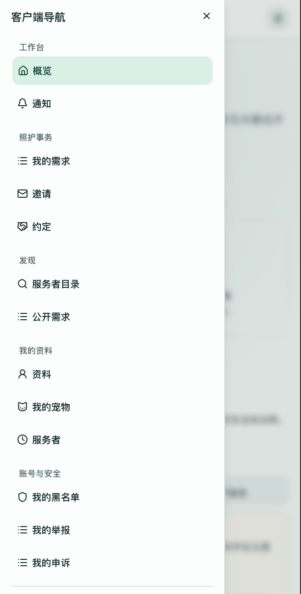</td>
    <td width="68%">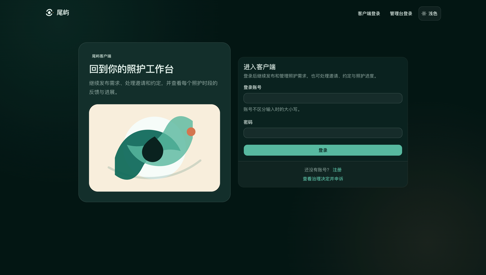</td>
  </tr>
  <tr>
    <td>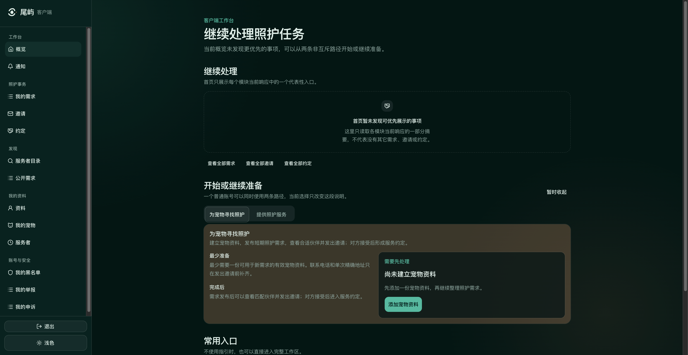</td>
  </tr>
  <tr>
    <td>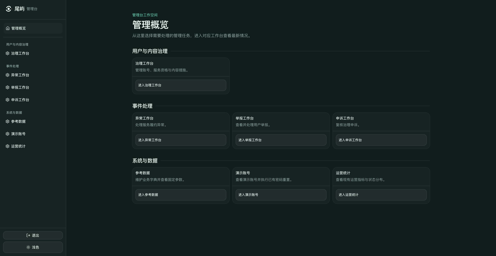</td>
  </tr>
</table>

### 好玩实验室 Rulefolio

面向独立桌游创作者、小型工作室和创作型俱乐部的桌面 Web 产品。它将作品材料、测试计划、试玩场次、玩家反馈、问题、调整决定和复测结论串联为可追查的规则迭代记录。

**公开源码：** [服务端](https://github.com/andrszan/rulefolio-server) · [前端](https://github.com/andrszan/rulefolio-web)。可在两个仓库中查看源代码与提交历史。

**功能模块：**

- **账户与协作空间：** 支持受控开通、登录退出、会话管理和账户恢复；可创建工作空间、邀请或移除成员，并管理协作资格。
- **作品与私有材料：** 支持私有作品和作品级角色授权，安全上传、预览和下载图片、规则与附件，并可建立或重置带开发账号和示例数据的可操作环境。
- **试玩计划与场次：** 维护当前规则和材料，制定测试目标、安排场次、邀请玩家、确认人数、固定测试材料，并记录实际参与者、时长、状态、结果和现场观察。
- **反馈、问题与复测：** 收集或代录文本、单选和数值反馈，将反馈与观察归纳为问题，记录处理决定与理由，再通过规则或材料调整及针对性复测更新结论。
- **待办、导出与恢复：** 汇总邀请、反馈、问题和复测待办，追踪邮件状态与重试；支持按角色导出作品资料、受控终止客户在线访问，以及恢复后的凭据撤销、关系核验和分阶段重新开放服务。

<table>
  <tr>
    <td width="32%" rowspan="3" valign="top">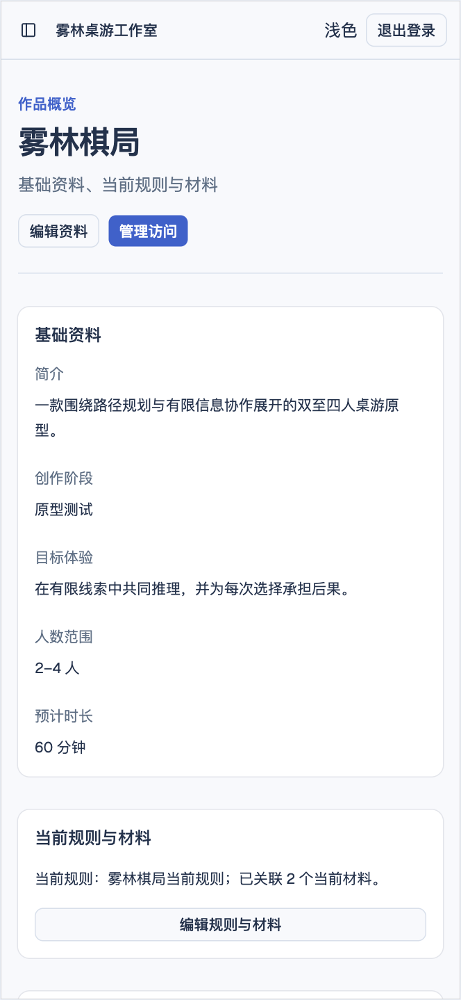</td>
    <td width="68%">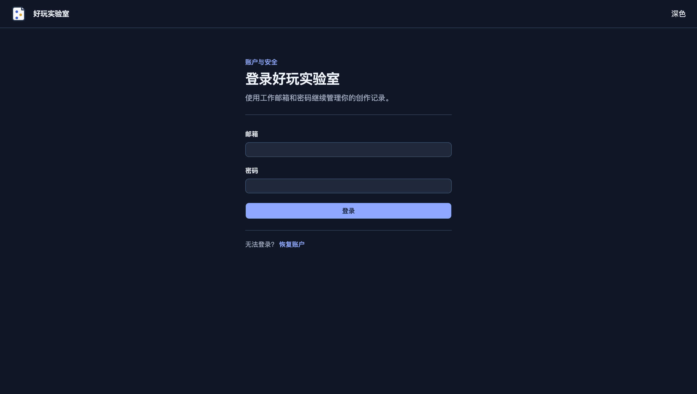</td>
  </tr>
  <tr>
    <td>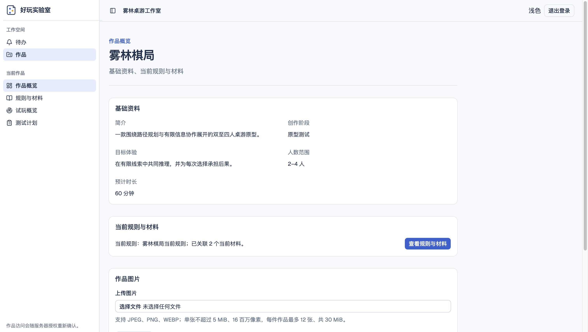</td>
  </tr>
  <tr>
    <td>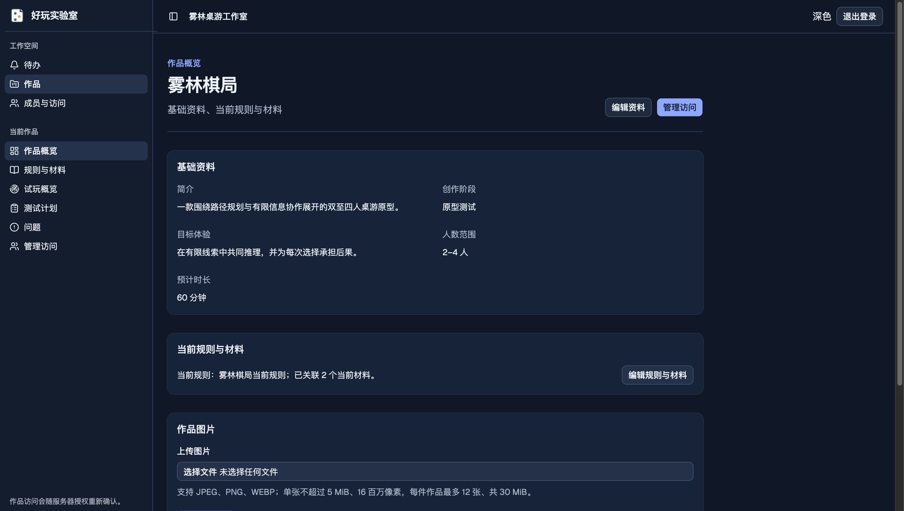</td>
  </tr>
</table>

## 仓库结构

```text
.claude/
├── skills/       # 第一方 Skills
├── agents/       # 开发与只读审查 Subagents
├── rules/        # 可复用项目规则
└── README.md     # 能力目录与使用边界
AGENTS.md         # 通用 Agent 工作规范
CLAUDE.md         # Claude Code 项目入口
catalog.json      # 基础工程模板选择快照
```

## 模板体系

PCM 将开发能力和基础工程分开维护：

| 仓库 | 职责 |
|---|---|
| [`pcm-agent-skills`](https://github.com/andrszan/pcm-agent-skills) | Skills、Subagents、规则和模板选择快照 |
| [`pcm-template-projects`](https://github.com/andrszan/pcm-template-projects) | 模板体系的上层导航、准入规则和治理 |
| [`pcm-frontend-templates`](https://github.com/andrszan/pcm-frontend-templates) | Next.js、React/Vite、Vue/Vite 等前端基础工程 |
| [`pcm-python-templates`](https://github.com/andrszan/pcm-python-templates) | FastAPI + SQLAlchemy 后端基础工程 |
| [`pcm-java-templates`](https://github.com/andrszan/pcm-java-templates) | Spring Boot + MyBatis-Plus 后端基础工程 |

[`catalog.json`](catalog.json) 是供 Skills 使用的机器可读选择快照，只登记业务无关、可独立运行的前端和后端项目起点。模板提供工程基础，不预置客户业务；具体的数据模型、接口、权限、页面和部署方式仍由目标项目决定并验证。

## 使用方式

将能力目录和项目规则放入目标项目，再从当前任务需要的能力开始：

```bash
cp -R .claude /path/to/project/
cp AGENTS.md CLAUDE.md catalog.json /path/to/project/
```

使用前需要：

1. 合并而不是覆盖目标项目已有的贡献规范和安全规则；
2. 根据目标项目准备语言运行时、依赖、数据库、外部服务和受保护配置；
3. 只调用当前任务真正需要的 Skill；
4. 使用目标项目自己的测试、构建、服务、数据和浏览器环境验证结果；
5. 将 API key、token、密码、私钥和个人认证信息保留在 Git 忽略的受保护配置中。

Claude Code、Git 和目标项目自身工具是基本依赖。部分能力可以使用额外浏览器、媒体或文档工具，但这些工具不会由本仓库自动安装，缺失时必须如实保留验证缺口。

## 边界与许可

- 本仓库只发布 Agent 开发能力，不包含客户项目、真实产品资料、运行状态、凭据或自动编排实现。
- 第三方 Plugin 和通用第三方 Skills 不随仓库分发；需要时由使用者按各自来源和许可证独立安装。
- 本仓库未对第一方内容授予开源许可。保留的第三方参考资源继续遵循各自许可证，详见 [`THIRD_PARTY_NOTICES.md`](THIRD_PARTY_NOTICES.md)。
