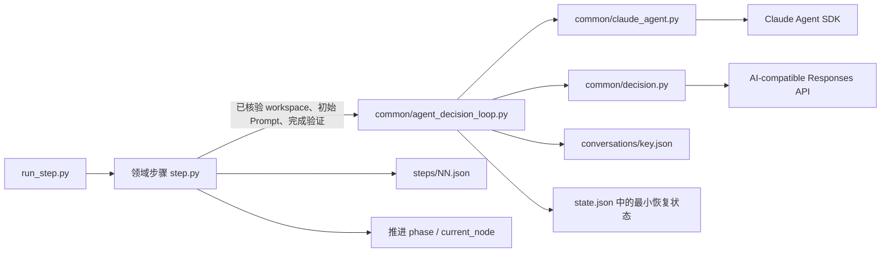
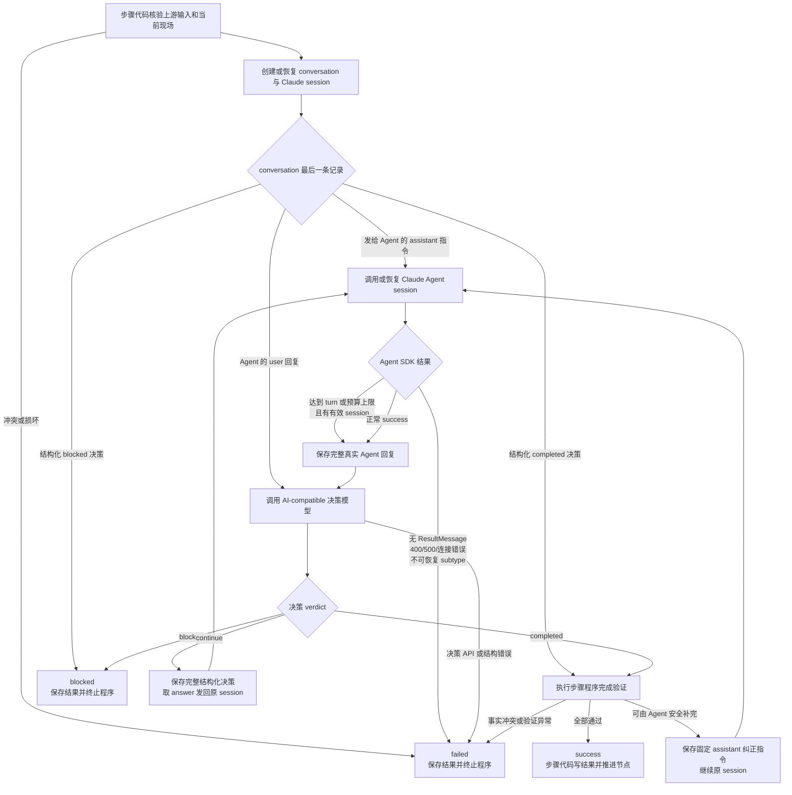
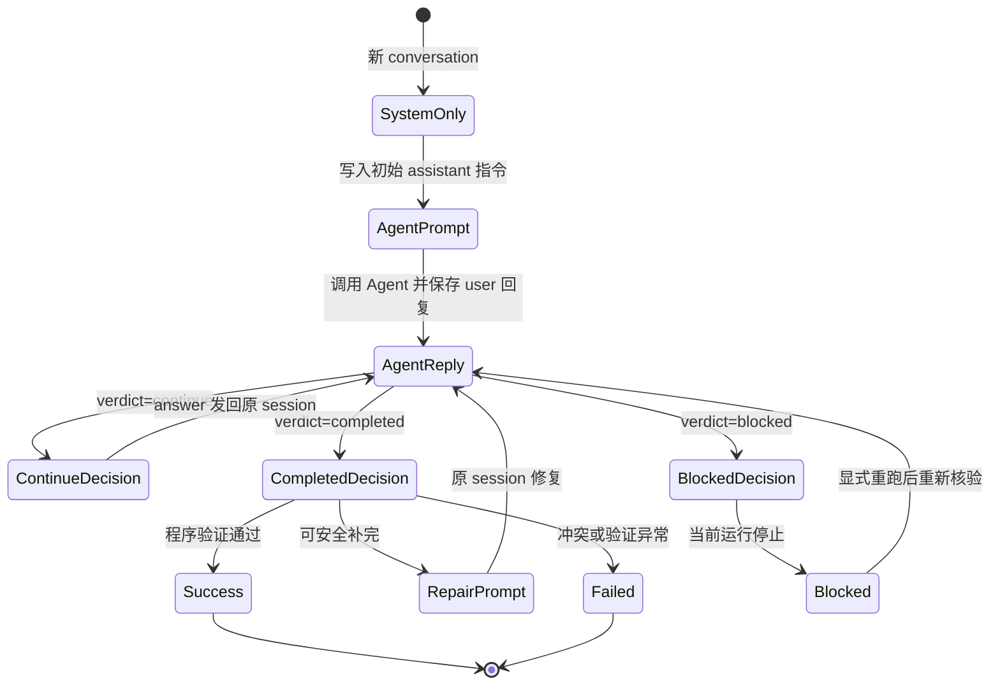

# PCM Demo 通用 Agent 决策对话循环 TRD

> 设计日期: 2026-08-22 
> 本文记录 PCM Demo 第 2、5、6、7、8 步已实现及第 9～11 步已实现的公共 Agent 决策对话循环技术合同。第 9～11 步旧 conversation、exact commit prompt、提交和测试事实均保留为历史运行路径，不构成新合同成功证据。
>
> 本文只定义通用执行与恢复机制；各业务步骤的输入、产物、完成条件、Git 核验和状态推进仍以步骤 README、Demo 项目设计和活动 TRD 为准。

## 1. 背景与目标

第 2、5、6、7、8、9 步都需要完成同一种长任务交互：

```text
Claude Agent 执行领域任务
→ 保存完整回复
→ AI-compatible 模型判断是否完成
→ 将继续指令发回原 Claude session
→ 直到完成、阻塞或失败
```

旧实现分别维护 conversation、session、决策轮次、待发送 prompt 和完成标记，已经出现以下分叉：

- Agent 正常结束是否可以直接代表步骤完成；
- Agent 回复是否在调用决策模型前落盘；
- 决策与 Agent 调用之间中断后如何恢复；
- max-turn、max-budget、API 和连接错误如何分类；
- 步骤成功后使用什么事实作为幂等锚点；
- Agent 回复是否会被步骤代码改写。

本次实现目标：

1. 用一个薄公共循环统一 Agent、决策、持久化与恢复；
2. 每一轮都由决策模型明确返回 `completed / continue / blocked`；
3. `completed` 后必须经过步骤程序完成验证；
4. conversation 尾部成为下一动作的权威事实；
5. 保留各步骤的领域输入、Prompt、验证和状态推进职责；
6. 兼容既有 run，但不继续写旧协议字段。

## 2. 非目标

本次不建设：

- 通用工作流引擎或流程 DSL；
- 数据库、事件总线或分布式事务；
- 大型基类、继承体系或万能 Hook 协议；
- Git、测试、浏览器和文件验证 DSL；
- 多模型路由、凭据路由或成本策略；
- Agent 指令 exactly-once 投递；
- 外层无限重试、YAML 兼容解析或宽松 JSON 修复器。单步 CLI 只在固定边界内对显式的 Claude Agent SDK 通道重试请求有界重放当前步骤两次，不属于无限重试，也不改变公共循环协议；业务 `blocked` 和普通失败不自动重放。

PCM Demo 只采用文件、固定写入顺序和幂等重放完成恢复。

## 3. 总体架构



### 3.1 `common/claude_agent.py`

负责：

- 构造 `ClaudeAgentOptions`；
- 调用 Claude Agent SDK；
- 收集 init、AssistantMessage 和 ResultMessage；
- 返回 session、完整回复、终止语义、turn 数和成本；
- 保留 API status、terminal reason 和安全异常类型。

自动压缩仅配置原生 `CLAUDE_CODE_AUTO_COMPACT_WINDOW`，默认正整数 `500000`，从 Settings/AgentConfig 显式传入 SDK 子进程；不采用 PCM 别名、MAX_CONTEXT 或额外百分比参数。runner 保持 `query()`，长调用中的压缩由原生 harness 执行，不增加恢复预检、手工压缩或同会话救援流程。配置窗口不是摘要目标大小，实际触发点受内置 CLI 的模型窗口和保留空间影响。

不负责：

- 读写 PCM 步骤状态；
- 判断领域产物；
- 决定步骤是否成功。

### 3.2 `common/decision.py`

负责：

- 定义统一 `AgentDecision`；
- 将统一角色、项目上下文、负责人职责、步骤完成条件和 Pydantic 输出合同分别渲染为新 conversation 的 `<role>`、`<project_context>`、`<responsibility>`、`<completion>`、`<output>` XML system prompt；
- 构造决策模型输入；
- 要求调用方显式传入该 system prompt，并原样传给一次 `responses.parse` 调用；
- 使用 Pydantic `AgentDecision` 取得结构化输出，不追加公共默认或隐藏格式 prompt，也不做格式重试。
- 解析新决定和兼容旧 `action` 记录。

### 3.3 `common/agent_decision_loop.py`

负责：

- conversation 读写和尾部状态解释；
- session、cwd、Skill、slash command 一致性检查；
- Agent 与决策模型交替；
- 决策轮次上限；
- `pending_agent_text` 恢复；
- blocked 显式重跑；
- SDK 结果分类和安全错误。

公共循环不导入 `steps.*`，不执行领域 Git、测试、浏览器或产物判断。第 8 步的权威多仓只读核验与干净基线逻辑、第 9～11 步的固定文档范围、只读 Git 核验和按需提交均仍由各步骤实现；不形成公共 Git DSL、通用提交抽象、commit 事件或持久布尔标记。

### 3.4 各步骤 `step.py`

负责：

- 校验上游结果和当前现场；
- 生成 Agent 初始 Prompt；
- 仅维护本步骤的领域 `DECISION_RULES`，并在调用公共循环前以已验证项目上下文生成动态 system snapshot；
- 定义程序完成验证与 repair prompt；
- 将公共 blocked 结果映射为步骤异常；
- 写入 `steps/NN.json` 并推进下一节点。

## 4. 核心数据合同

### 4.1 `AgentDecision`

```text
verdict: completed | continue | blocked
answer: string
reason: string
required_inputs: string[]
```

字段约束：

| verdict | answer | required_inputs | 含义 |
|---|---|---|---|
| `completed` | 空 | 空 | 负责人根据 Agent 的执行结果相信当前领域任务已完成，仍须通过步骤程序核验 |
| `continue` | 非空 | 空 | 需要将明确指令发送回 Agent |
| `blocked` | 空 | 非空 | 缺少不可替代外部资源 |

`reason` 始终非空，用于记录裁决依据。

### 4.2 `AgentDecisionLoopSpec`

每个步骤提供一个不可变配置：

```text
key                    conversation 与 session 的领域键
state_key              步骤私有状态键
skill_name             必须实际加载的 Skill / slash command
max_decision_rounds     最大结构化决定数
max_turns               单次 Agent SDK turn 上限
max_budget_usd          单次 Agent SDK 成本上限
decision_system_prompt 由统一渲染器生成的完整 system snapshot
legacy_completion_messages  既有公共循环读取旧记录的兼容字段；第 9～11 步新合同不依赖或新增旧 prompt 兼容列表
```

### 4.3 `ClaudeRunResult`

公共循环使用的主要事实：

```text
init
text
result_subtype
is_error
session_id
stop_reason
num_turns
total_cost_usd
api_error_status
terminal_reason
has_errors
exception_type
```

Agent 回复 `text` 与 SDK/API 异常分开处理：前者完整保存，后者只持久化安全分类。

正常结果的 `text` 保留单次 `query()` 调用内主 Agent 的全部可见 `TextBlock` 和最终 `ResultMessage.result`，不包含 thinking、工具调用/结果、带 `parent_tool_use_id` 的子 Agent 消息或此前 session 历史。有过程文字时，只用 `<过程说明>…</过程说明><最终回复>…</最终回复>` 分区，正文 XML 转义以保留原意并避免标签混淆。解释规则只放在 system：过程用于补充依据，最终回复用于判断当前状态，已被最终回复解决、替代或否定的阶段性事项不再作为当前缺口。普通恢复仍使用冻结的历史 system，不自动改写；需要旧会话采用新解释规则时，须经明确授权单独更新其 system。

仅在最终结果与连续完整尾部文本块按换行拼接后完全相同时移除该尾部重复，不做全局去重、子串裁剪、语义筛选、摘要或截断。没有过程文字时保持原最终纯文本；缺少正常最终结果时保留既有收集文本回退与错误判定，不把过程标作成功最终回复。Result 回调先组装一次，最终返回复用同一正文，保证 pending 落盘与恢复不丢失过程依据、不重复包装。

## 5. 完整决策流程



### 5.1 成功条件

最终成功必须同时满足：

1. Agent SDK 以正常 `success` 结束；
2. 决策模型返回 `completed`；
3. 步骤程序完成验证通过。

开发领域的负责人按交付结果判断：功能已实现、核心路径及适用关键风险已有可信证据、无已知阻断缺陷或未决重大选择时可 `completed`，并在 reason 披露非阻断验证限制。Agent 自报“未完全验证”不自动决定状态，须先区分必要交付缺口与某种验证方法或长期观察的限制；已被有效证据覆盖的行为，不要求特定开发样本等满业务周期。真正的必要功能缺失、关键失败或关键证据缺口仍须处理；不将这些问题伪装成非阻断限制，也不为满足观察方式篡改既有业务历史。

任何单项都不能独立代表步骤成功。

### 5.2 程序完成验证

步骤提供的 verifier 返回：

```text
None          当前完成事实通过
非空字符串    可由 Agent 安全补完的固定 repair prompt
抛出异常      状态、路径、Git 或交接冲突，步骤 failed
```

当 verifier 返回 repair prompt：

- 保留真实 `completed` JSON；
- 追加普通 `assistant` 修复指令；
- 恢复同一 Claude session；
- 等待下一轮 Agent 回复和新裁决。

旧 `completed` 因后继 repair prompt 不再位于 conversation 尾部，自然失去终止效力。

## 6. Conversation 尾部状态机

Conversation 文件：

```text
runs/<run-id>/conversations/<key>.json
```

角色约定：

- `system`：新 conversation 保存的动态 system snapshot；恢复时严格读取历史 `messages[0]`，不重渲染或覆盖；
- `assistant`：实际使用 Claude Code Agent 的项目负责人、工程负责人和 Agent 专家发给 Agent 的初始、继续或修复指令，或该负责人每轮返回的 `AgentDecision` JSON；也包括真正的人通过 `--resume-message-file` 提交的负责人恢复指令，正文原样保存；
- `user`：Claude Agent SDK 返回的完整真实 Agent 回复，按 §4 的过程说明/最终回复合同保存。

今后新建的每条消息均带 `timestamp`，表示该条 conversation 消息创建时的北京时间（ISO 8601，显式 `+08:00`），不是 Agent 调用的开始时间：

```json
{"role":"user","content":"Agent 回复","timestamp":"2026-09-08T20:15:30.123456+08:00"}
```

该字段涵盖新 system、初始/继续/修复/人工指令、负责人决定和 Agent 回复，也涵盖确定性恢复追加的完成消息。时间在创建时记录；加载、保存、重放不刷新，pending 回复在首次加入 conversation 时记录。旧消息仍允许只有 `role/content`，不补时间、不补 null、不回填历史。读取接受这两种结构并校验新增时间，未知字段仍拒绝；去重和尾部状态判断只看原有角色与正文，不因 timestamp 重复追加。timestamp 仅供查看，不进入负责人模型的序列化输入，也不加入发送给 Agent 的指令正文。



尾部恢复规则：

| conversation 尾部 | 下一动作 |
|---|---|
| `system` | 写入初始指令并调用 Agent |
| 普通 `assistant` | 将该指令发给 Agent |
| `user` | 请求决策，不重复调用 Agent |
| `continue` | 将 `answer` 发回原 session |
| `completed` | 重新执行程序完成验证 |
| `blocked` | 返回 blocked；显式重跑时重新核验外部条件 |

最终成功时 conversation 尾部就是 `completed`，不再追加 Python 固定完成声明。

### 6.1 人工负责人恢复指令

`run_all.py --resume <run-id> --resume-message-file <path>` 与 `run_step.py --step <step> --run-id <run-id> --resume-message-file <path>` 提供人工负责人接管当前 blocked 决定的入口。它不是自由跳转或强制 completed：仅已有 run、当前 blocked 节点、对应的原 Agent 对话/session 可使用；没有 Agent 对话的确定性阻塞明确拒绝，不能静默丢弃意见或新建 session。

- 文件可以在任意目录，支持绝对路径和按调用者工作目录解析的相对路径；推荐 txt/md，但不限制扩展名。不要求结构化字段或 frontmatter。
- CLI 在执行锁内、业务状态变更及计时落盘之前校验当前阻塞位置与文件；只读取一次 UTF-8 正文。缺失、非普通文件、不可读、无效编码或全空白均报输入错误，不覆盖原 blocked 业务结果。检验非空不改变正文，保留首尾换行等原始文本。
- 目标对话尾部为 blocked 决定，或该阻塞后的恢复指令尚未获得 Agent 回复时，保留旧历史并追加普通 `assistant` 人工正文。尤其允许已有泛化 `BLOCKED_RESUME_PROMPT` 后再追加人工指令。
- 必须先持久化人工正文，再发送同一正文给原 Claude session；文件路径本身不是发给 Agent 的指令。发送前不调用负责人决策模型预审，也不再补发泛化恢复提示。
- Agent 返回后仍追加真实 `user` 回复并进入既有决策流程。决策模型可以看到人工指令及其执行结果；真实缺口仍应如实报告，不因人工要求继续而伪造资源、批准或验证。
- 同一 CLI 执行中的自动重试共享仅内存的消费状态；本次消息不能在后续再次 blocked 时重复注入。人工恢复不重置或扩大既有裁决轮数上限，额度不足时在追加正文前明确拒绝。`run_all` 只向当前子步骤传递该参数；同一步有多个 loop 时只向真正的阻塞对话发送，不能投递给已完成或新开启的相邻对话。
- 新输入无法确定合法投递目标时明确拒绝，不允许步骤先成功后才发现输入未被消费。已有 `pending_agent_text` 继续按原持久化协议处理，不丢弃既有回复或将其冒充为人工指令执行结果。

人工正文不增加 conversation schema 字段。识别结构化模型决定及旧完成标记时，要求该 `assistant` 紧随 Agent 的 `user` 回复；在旧 blocked/generic `assistant` 后追加的人工正文即使恰好是合法 `AgentDecision` JSON 或旧完成标记，也只能作为普通指令投递，不触发完成、不计入模型裁决轮数。

正文原样进入 PCM conversation、Agent session 和模型请求，不提供秘密扫描或自动脱敏。外部系统密码、API key、令牌等先写入已有受保护配置，人工指令只引用配置位置、键和资源说明。文件参数避免正文进入 shell 命令行，不意味着正文不会持久化或发给模型；CLI 错误与普通运行日志不主动回显正文。

## 7. 持久化与中断恢复

### 7.1 最小状态

```text
claude_sessions.<key>
decision_conversations.<key>.path
<state_key>.last_agent_result
<state_key>.pending_agent_text
<state_key>.last_decision_failure
```

不再新写：

- `pending_agent_prompt`；
- decision turn；
- `COMPLETION_MESSAGE`。

决策轮次直接从 conversation 中紧随 Agent `user` 回复的可解析负责人决定数计算，人工恢复指令不计入。

### 7.2 Agent 回复写入时序

```mermaid
sequenceDiagram
    participant Step as 领域步骤
    participant Loop as 公共循环
    participant Agent as Claude Agent SDK
    participant State as state.json
    participant Conv as conversation.json
    participant Judge as 决策模型

    Step->>Loop: 已核验上下文 + 初始 Prompt + verifier
    Loop->>Conv: 先保存 assistant 指令
    Loop->>Agent: 调用或恢复 session
    Agent-->>Loop: init / ResultMessage / 完整回复
    Loop->>State: 保存 session、last_agent_result、pending_agent_text
    Loop->>Conv: 追加完整 user 回复
    Loop->>State: 清除 pending_agent_text
    Loop->>Judge: 发送完整 conversation
    Judge-->>Loop: AgentDecision JSON
    Loop->>Conv: 追加 assistant 决策
```

如果进程在 ResultMessage 与 conversation 写入之间中断：

1. `pending_agent_text` 已保存；
2. 重启后先把它补成 `user` 消息；
3. 再调用决策模型；
4. 不重复调用 Agent。

Prompt 投递采用 at-least-once 语义。自动恢复指令使用幂等的“重新读取当前事实并继续”，不为 Demo 建设 exactly-once 协议。人工恢复正文落盘后如遇中断，普通恢复从 conversation 尾部复用正文，不再读取源文件；源文件被删除或修改不改变这条已持久化指令。同一命令自动重试不重复追加人工消息，但不能据此宣称 Agent 或其业务操作恰好执行一次。只有用户显式提交新意见时才再次提供 `--resume-message-file`；普通恢复命令不保留旧文件参数。

### 7.3 AI-compatible 裁决失败诊断

负责人裁决失败时，公共循环不写伪 assistant 消息，也不改变 `user` 尾部恢复锚点。它在 `<state_key>.last_decision_failure` 覆盖保存可恢复的安全摘要，通过专用 `AIDecisionFailure` 将同一摘要交给步骤结果，并将完整有界诊断覆盖写入 Git 忽略的 `logs/<领域键>-decision.json`：

```json
{
  "kind": "configuration | transport | http | response | internal",
  "http_status": 403,
  "request_id": "request-id",
  "provider_code": "PERMISSION_DENIED",
  "provider_type": "permission_error",
  "provider_message": "quota exhausted; api_key=[REDACTED]",
  "message": "quota exhausted; api_key=[REDACTED]",
  "diagnostic_path": "logs/trd_design_BR-002-decision.json"
}
```

`kind` 是稳定诊断分类；AI-compatible 裁决诊断不参与自动重试。HTTP status 必须是合法整数，request ID 只接受长度不超过 128 的 `[A-Za-z0-9._:-]`。provider code/type/message、异常类型、异常链和 traceback 位置在写入前统一限长，并只遮盖调用方已知真实 secret、Authorization/Cookie、明确敏感键值、URL/DSN 密码及敏感 query；普通错误文字和 token 语义不删除。日志不保存完整 headers、请求/响应 body、prompt、环境字典或 `.env`。合法 assistant decision 成功写入 conversation 后清除 state 中当前失败引用，但保留 Git 忽略的诊断快照；不新增历史数组、时间戳或重试计数。`run_step.py` 只消费本次异常对象上的瞬时重试请求，该请求不进入诊断、state、步骤 result 或 conversation。

## 8. Agent SDK 结果分类

| 结果 | 处理 |
|---|---|
| `success` + 正常 terminal reason | 保存完整回复并裁决 |
| `error_max_turns` / `error_max_budget_usd` + session + 回复 | 允许裁决，但必须恢复并取得后续正常 success |
| 本次 SDK API 错误明确为上下文超限，且未在同次调用中恢复成功 | `failed`，准确诊断，不请求同输入自动重试 |
| 其它 API 状态或明确 `api_error` terminal reason | 保存 `failed`，同时发出不持久化的外层重试请求 |
| 无 ResultMessage，且原因为 SDK 连接失败或 CLI 进程失败（未确认为上下文超限） | 保存 `failed`，同时发出不持久化的外层重试请求 |
| 无 ResultMessage 的其它异常 | `failed`，不自动重试 |
| CLI 未安装、消息解析或协议异常 | `failed`，不自动重试 |
| session/cwd/Skill/slash command 不一致 | `failed`，不自动重试 |
| `aborted_streaming` / `aborted_tools` | `failed`，不自动重试 |
| `success` 携带其它未知 terminal reason | `failed`，不自动重试 |

已取得结构化 ResultMessage 后的尾随进程异常不单独请求外层重试，避免重复执行已经产生副作用的 Agent 工作；若该 Result 本身带 API 状态或 `api_error` 终止，除明确上下文超限外仍由结构化 API 事实请求重试。超限只从 SDK API 错误标识及窄化错误格式识别，不扫描普通业务或工具正文；不能把所有 400 都视为超限，也不能因同次调用早期曾超限而否定后续正常成功。max-turn/max-budget 结果继续按既有可恢复语义在公共循环内处理，其它异常不进入决策循环。`ClaudeRunResult` 同时保留 `ResultMessage.errors`、`api_error_status`、`terminal_reason` 和捕获异常的安全正文、异常链与 traceback 位置。公共循环在 Agent 失败时覆盖写入 `logs/<领域键>-agent.json`，`last_agent_result`、步骤结果和 stderr 只保存具体安全原因及 `diagnostic_path`；第 17 步同样通过公共循环复用这些诊断与恢复能力。

## 9. `blocked` 与 `failed`

### `blocked`

只用于当前环境无法取得的不可替代外部条件，例如：

- 外部账号或真实凭据；
- 客户私有数据或授权；
- 专用设备、付费服务或线下动作。

### `failed`

用于：

- 输入、状态、路径或交接错误；
- SDK、API、解析或程序错误；
- Git、文件或完成验证冲突；
- 无法形成合法结构化决定。

`blocked` 和 `failed` 都结束当前单次步骤执行，`continue` 只存在于公共循环内部，不成为第四种步骤结果。CLI 只在当前异常显式携带 Claude Agent SDK 通道重试请求时有界重放两次；普通 `blocked`、确定性 `failed`、AI-compatible 裁决失败、本地合同错误和取消均在首次执行后退出。第三次仍请求重试时对外归一为步骤失败码 `1`。

## 10. Prompt 合同

每个步骤分别维护：

1. Agent 初始 Prompt；
2. 领域 `DECISION_RULES`；
3. 程序 repair prompt。

`common/decision.py` 仅在新 conversation 创建时，将统一负责人角色、已验证项目上下文、统一职责、该步骤领域完成条件和 Pydantic 输出合同分别渲染为完整 XML system snapshot；公共循环首次保存该 snapshot。恢复已有历史时严格使用 `messages[0]`，不依据当前文件重新渲染或覆盖历史。

统一要求：

- snapshot 的 XML 标签严格为 `<role>`、`<project_context>`、`<responsibility>`、`<completion>`、`<output>`；步骤 `DECISION_RULES` 只进入 completion，不与统一职责混写；output 明确 `completed` 的 `answer`/`required_inputs` 均为空、`continue` 的 `answer` 非空且 `required_inputs` 为空、`blocked` 的 `answer` 为空且 `required_inputs` 非空，并要求所有 `reason` 非空；
- AI-compatible 角色是实际使用 Claude Code Agent 的项目负责人、工程负责人、专业开发者和 Agent 专家，`assistant` 是其此前发给 Agent 的指令或结构化回复，`user` 是 Agent 返回的完整执行结果；
- `completed` 只表示负责人根据 Agent 执行结果相信当前任务完成，步骤程序仍以现有文件、Git、命令和交接 verifier 二次核验；
- 首行 slash command 只属于 Agent initial prompt；该 prompt 正文不写步骤编号、PCM 节点、阶段、session 或 Skill 编排；
- `request_decision` 的 system prompt 为必传参数，并原样传给一次 `responses.parse`；Pydantic `AgentDecision` 是唯一结构化输出合同，没有公共默认 system prompt、公共 JSON 追加 prompt 或格式重试；
- 项目上下文范围固定为：第 2 步初稿原文和目标路径；第 5 步产品定义原文、适用工程、选型白名单投影及资源清单仅路径/可读性；第 6 步的 `project_bootstrap` spec 使用产品定义原文、准备清单原文、适用工程和组装白名单投影，`tailwind_theme` spec 另以产品定义原文、实际 frontend 和基础视觉主题边界形成独立 snapshot；第 7 步使用产品定义原文、准备清单原文、适用工程和组装白名单投影；第 8 步合法有序 `applicable_repositories`；第 9～11 步各自的固定领域输入、权威工程和固定输出路径。第 8～11 步其余只读 Git 核验与 verifier 仍由步骤私有实现；
- 选型和组装投影不包含 `git_url`、`origin`、`remote`。资源清单正文和 `.env` 不进入项目上下文；资源清单仍按步骤 Agent initial prompt 的既有授权处理；
- 项目上下文只做标准 XML 转义；
- repair prompt 只说明程序发现的固定缺口。

## 11. 完整回复与输入边界

新 run 的 Agent 回复在以下位置保持完全一致：

- `pending_agent_text`；
- conversation 的 `user` 消息；
- 决策模型输入。

不进行后处理摘要或脱敏替换。run 目录是受控、Git 忽略的本地恢复状态，不建设防篡改日志。

资源清单正文和 `.env` 因输入来源边界不进入决策项目上下文。Claude Agent SDK 与 AI-compatible Responses/裁决异常保留经精确凭据遮盖和限长的具体原因；SDK `errors`、provider code/type/message/request ID/HTTP status、异常链和 traceback 位置进入 Git 忽略诊断快照，state/result/stderr 只保存安全摘要和引用。诊断不进入裁决上下文，也不读取或输出 `.env` 具体值。

## 12. 步骤适配

| 步骤 | 初始领域任务 | 程序完成验证 |
|---|---|---|
| 2 `project-intake` | 收敛产品定义两件套 | 两份固定产品定义为非空普通文件 |
| 5 `project-readiness` | 核验进入项目化前的资源与配置 | 固定准备清单为非空普通文件 |
| 6 `project-bootstrap` / `tailwind-theme` | 同一数字步骤先有限项目化和真实工程验证；有 frontend 时再以独立 spec/session/conversation 落实项目专属 light/dark 主题 | bootstrap 核验前序交接、根 README、工程和 Git 边界；theme 前置核验 Tailwind v4 CSS-first，完成后复验 gate、工程和 Git 边界；最终 marker 严格对应 frontend |
| 7 `solution-design` | 基于真实工程形成总体技术方案 | 固定方案文档、前序交接和 Git 边界 |
| 8 `commit-changes` | 对权威仓库清单形成首次全仓干净基线；已全干净时零调用，dirty 时同一产品根 session 处理必要提交 | 步骤专属多仓 top-level、`main` 与工作树只读核验 |
| 9 `engineering-architecture` | 必须基于固定权威输入形成工程架构文档；文档 repair 后，仅在根仓存在且仅存在固定文档未提交变化时才在原 session 调用 `commit-changes` | 固定文档非空、非符号链接、tracked；全体权威仓库当前为自身 top-level / `main` / clean |
| 10 `ui-ux-framework` | 仅第 8 步严格交接含 `frontend` 时适用；不适用路径按执行产物存在性拒绝并零副作用 | 适用时固定文档非空、非符号链接、tracked；全体权威仓库当前 clean；不适用时 `applicable:false`、空 outputs |
| 11 `requirement-breakdown` | 基于严格第 2/5/7/8/9/10 交接形成固定 Backlog；只在唯一根仓文档未提交变化时调用 `commit-changes` | 固定 Backlog 非空、非符号链接、tracked；全体权威仓库当前为自身 top-level / `main` / clean |
| 17 `commit-changes` | 在产品根创建独立提交 session，处理当前需求的有序权威仓库白名单；同一提交会话内继续、修复和恢复 | 各仓仍在统一需求分支，`base ≤ main ≤ HEAD == target`（祖先关系），无进行中的 Git 操作，工作树与暂存区 clean；记录实际 `tip_sha` |

第 17 步保留第 15/16 步的开发 session 与完成事实，但不再以其 ID 预填提交别名。首次有变更时不传 resume，公共循环捕获新 ID 到 `claude_sessions.requirement_commit_<ID>`；后续只恢复该提交会话。全仓 clean 和已有完整成功结果不额外创建会话。init 前失败且只保存初始指令、没有 ID 或 Agent 回复的准备态可重新开始；已发生交接却丢失 session/历史的损坏状态不允许用新会话掩盖。旧失败提交仍绑定开发 session 时须明确备份迁移，只处理该提交尝试的元数据与当前对话，不自动删除开发历史。

提交准备允许精确 `.gitignore`、逐路径清理已确认可再生的非交付临时产物，以及 hook 纯格式修复；未知资产、数据和秘密不删除，不使用宽泛清理，不修改业务逻辑、接口/数据语义或测试断言。调用方更窄的范围与只读约束仍优先，不因第 17 步许可放宽其它步骤。

需求收尾保留创建需求时的 `base_sha`，不要求首次提交时 HEAD 仍等于 base，也不要求当前 main 永远停在 base。第 17 步首次、提交后和恢复均以捕获的 SHA 校验 `base ≤ main ≤ tip`；功能分支已有提交时可以继续提交，所有仓库干净时记录当前 tip，不制造空提交。已保存成功结果的恢复仍须与当前 tip 精确一致。

第 18 步以当前 main 与第 17 步保存的 tip 检查同一祖先关系，已合并 no-op 也须保留有效原始历史。切换到 main 后重新核验引用与工作区；引用发生变化时停止，不沿用过期判断。执行 `git merge --ff-only <保存的 tip SHA>`，避免需求分支引用在检查后移动而合入未经记录的提交；合并后与清理恢复仍严格核验 main/HEAD 等于保存 tip。分叉、main 领先 tip、丢失原始 base 历史或错误分支均拒绝，不强制覆盖，也不通过改写 base 放行。多仓中途失败保留已完成事实，按原恢复协议续接，不承诺跨仓原子合并。

第 6 步没有适用基础工程时，继续 `applicable: false` 无副作用跳过，两个 spec 都不调用；backend-only 只运行 `project_bootstrap`，frontend 路径在 bootstrap 完成后才运行独立 `tailwind_theme`，两个领域都完成前不写 success。第 6 步没有新增节点或公共多阶段 runner，theme blocked/failed 后重跑只实际恢复 theme。第 9 步始终 `applicable: true`，不存在简单项目跳过或不适用结果；第 10 步仍按第 8 步严格交接是否含 `frontend` 确定，未含时按执行产物存在性拒绝且零 Git、Agent、负责人决策、LLM 配置和文档副作用。第 11 步与第 9 步同样仅在固定 Backlog 造成唯一根仓未提交变化时调用 `commit-changes`。

## 13. 旧记录兼容

读取兼容：

- 旧 `action: blocked` → `blocked`；
- 旧其它 action → `continue`；
- 旧非阻塞 action 的空 `answer` → 固定安全继续提示；
- 旧 `{path, turn}` → 读取 path，轮次由 conversation 重算；
- 旧完成 sentinel → 重新执行程序完成验证；
- 旧 `pending_agent_prompt` → 丢弃，不重新发送。

兼容原则：

- 旧 conversation 不转换、不覆盖；
- 新 run 只写新 `verdict` 结构；
- 旧内部控制 JSON 不得作为普通 Prompt 发给 Agent；
- 已推进且步骤结果完整的 run 继续按幂等成功事实复用；第 6 步完整 success 另要求真实布尔 `tailwind_theme == ("frontend" in outputs)`，旧结果缺失或不一致 marker 不保护；
- 第 9～11 步完整 success 的保护、result→state 中断恢复和完整 success 重跑均只依严格 result schema、当前固定文档和 Git事实，不依赖 conversation；字段残缺的 success 不保护。

## 14. 验收与真实证据

自动化验证：

- 公共精确脱敏、Claude Agent SDK/Responses/负责人裁决诊断、显式 SDK 通道重试、第 14 步零 Agent 恢复及 CLI 映射已完成；PCM Demo 全量 351 项 `unittest`、`compileall common steps run_step.py run_all.py test_run_step_retry.py test_run_all.py` 与 `git diff --check` 通过。现行重试 7 项覆盖首次成功、显式请求后恢复、三次耗尽归一、普通失败、CLI 错误、桥接映射和主动取消；公共循环测试另覆盖任意 API 状态、连接/进程异常、本地合同错误与瞬时标志不落盘。当时统一重试 5 项及“任意非 success 后恢复”只属于旧策略自动化历史；本次未为了制造错误调用真实外部服务。

兼容验证：

- 旧 action、完成 sentinel 和 `{path, turn}` 均可读取；
- 旧 `step08-real-20260823-a/b` 继续按旧“唯一初始提交证明”合同解释，不改写为当前合同证据；
- 真实 run `step01-mendmark` 的目录名与 state 内历史 `run_id` 不一致是既有已知事实；当前第 8 步依据 state、产品路径和现场继续核验并已推进到第 9 步入口。

真实集成验证：

- BR-002 第 14 步首次 Agent 正常 `success` 并生成活动 TRD，随后负责人裁决异常因旧实现被压缩而失败；实现结构化诊断后，同一 `system → assistant → user` conversation 零 Agent 重跑，负责人返回合法 `completed`，既有 TRD 通过 verifier，步骤推进第 15 步。原始失败已无法追溯具体类别。
- BR-002 第 15 步曾先后返回流断开和 HTTP 500；后续负责人又连续两次返回带 Markdown 代码围栏的 JSON。在当时旧的“任意非 `success` 均重试”策略下，前两次非 `success` 后按 10 秒、30 秒重放当前步骤，第三次负责人返回合法 `completed`。该事实只证明旧策略下的真实恢复结果，不定义现行重试范围；第 16～18 步随后完成，BR-002 生命周期回到 completed。

- Git 忽略 run `prompt-role-replay-20260823` 保留旧四段 XML system snapshot 的历史回放，不再作为现行五段 prompt 证据；现行 prompt 已由第 9 步 fresh 真实运行验证。
- 首次尝试复用旧隔离第 7 步工作区时，在请求 API 前因不满足现行第 4 步 Git 元数据合同停止；最终改用现行交接事实回放，不将该前置停止记录为失败 run。
- 隔离 run：`agent-loop-step7-20260822T190149Z`；
- 新 `solution_design` session 完成 init、错误现场保留和同 session 恢复；
- 真实 Agent 正常结束并生成技术方案；
- 决策服务曾在旧格式约束下返回 `completed`；该历史不证明现行 XML prompt；
- 隔离验证注入文档置空，触发固定 repair prompt；
- 原 session 补回文档并再次 `completed`；
- conversation 尾部为 `completed`，无旧 sentinel 或 `pending_agent_prompt`；
- 最终状态推进到 `project:08_initialize_repositories`。

第 8 步旧合同真实运行：

- `step08-real-20260823-a` 保留旧“唯一初始提交证明”合同下的失败链路：第 1 步先后出现代码围栏、Responses `incomplete`、自创字段，收紧严格 JSON prompt 后同 run 成功；第 3 步一次 `ValidationError` 后同 run 重试成功；第 7 步 API 500 暴露 failed `07.json` 会错误阻断恢复，修复为仅 `status=success` 可复用后同 session 成功；第 8 步因未处理的模板 `.coverage`，Agent 未提交，决策模型重复索取调用方授权并耗尽 8 轮，未产生三仓提交。
- `step08-real-20260823-b` 是旧合同下的历史成功：第 6 步真实清除 `.coverage` 后，session `64aa707c-268c-48c8-bb3f-f67f62abe75e` 的 conversation 为 `system → assistant → user → assistant`，一次 Agent 回复和一次 `completed` 裁决完成。root、frontend、backend 的唯一无父 `main` 提交依次为 `c1eb33dfa5bda91a0d7f9aeeb41d8fefe10a6fca`、`5997213c34c09ea6ba4e740e35f9df77d2d45d82`、`5d8dd95d8c42370697d25e6ecaf400bab42785b3`；状态推进至 `project:09_engineering_architecture`。这些 SHA、提交形态和重跑事实不再是当前合同完成条件。

第 8 步当前合同真实运行：

- 真实 run 目录为 `pcm-demo/runs/step01-mendmark`，state 内历史 `run_id` 不一致是既有已知事实；产品工作区为 `/Users/zhou/resource/fireworks/ANDRSZAN/pcm-products/mendmark`。权威仓库为 `root/frontend/backend`，第 4 步 `outputs` 为 `frontend/backend`；首次执行前三仓均为自身 top-level、`main`、dirty 且 HEAD 不存在。
- 首次执行只创建 `initialize_repositories` session `f6d42df8-13e5-437b-ada3-eef1015ecc87`。Agent 尝试内置 Explore 时遇到环境未识别模型 `gpt-5.6-sol[1m]`，无 Result、无 Git 变化，进程挂起后停止；session、conversation 和 init 证据已保存。这是环境内部子代理问题，不是第 8 步业务或 Git 逻辑失败。
- 仅在该 Git 忽略 run 历史中追加普通恢复指令“不要使用子代理/Explore，直接工具完成”，生产 prompt 和代码未改变；重跑恢复同一 session。Agent 先创建 frontend `dbab574dbe4d83a02323a750afd04de007565ac5` 和 backend `9682be837759c20f1a9ebbdf8fa2cfc09c2768d4` 两个本地提交，未 push，随后针对根仓运行时产物和 `.agents/plugins/superpowers/.git` 请求决策。
- AI-compatible 负责人返回 `continue`：删除 61 个 `.in_use/*`、`.orphaned_at`、`.coverage` 运行时产物、补 `.gitignore`、移除 superpowers 嵌套 `.git` 并按普通受控插件快照提交，不采用 submodule。同一 session 继续后，root 创建 `02ba4c1`（产品与技术基线）、`ae72c31`（Agent 规范与 Skills）、`5eeeacd217bbd27e03483b1b6d32915c721aadd9`（插件快照）三个本地提交，未 push。
- 最终 conversation 共 7 条，角色顺序为 `system → assistant 初始 → assistant 恢复 → user → assistant continue → user → assistant completed`。Agent 最终正常 `success`，26 turns，约 `$1.859406`，session 不变。
- Python 只读 verifier 写入 `steps/08.json` success：`applicable_repositories` 为 `root/frontend/backend`，result 保存相对路径，state 保存绝对路径，并推进到 `project:09_engineering_architecture`。独立 Git 核验确认 root HEAD `5eeeacd217bbd27e03483b1b6d32915c721aadd9`、3 commits，frontend HEAD `dbab574dbe4d83a02323a750afd04de007565ac5`、1 commit，backend HEAD `9682be837759c20f1a9ebbdf8fa2cfc09c2768d4`、1 commit；三仓均在 `main` 且 `status --porcelain` 为空。这证明当前合同允许每仓 0、1 或多个提交，不要求唯一无父提交。
- 同 run 重跑第 8 步直接 clean 幂等成功，conversation 仍为 7 条，未再次调用 Agent 或决策模型，SHA 不变。backend 提交阶段 Agent 摘要报告 Ruff、格式、build 通过，`pytest` 14 passed、1 skipped，跳过项需要显式 `DB_*`；该摘要不是 Python verifier 条件，也不改变第 6 步历史项目化验证。
- 当前合同已完成真实 Agent 集成验证，但首次成功包含 run-local 恢复指令，不能宣称环境内部子代理问题已经解决或无需恢复。

第 9～11 步现行合同：

- 三步继续使用公共 `run_agent_decision_loop` 保存、读取和解释完整 conversation。领域步骤不解析消息 schema、角色顺序、尾部 decision、session/reference 组合或完整 commit prompt，不把 conversation 当长期成功证据。fresh 只按本步骤 session/reference/private state/conversation 路径等执行产物存在性拒绝；resume 交给公共循环。run 目录是受控、Git 忽略的本地恢复状态，不建设防篡改日志。
- 第 8 步只交接 strict success 的空 `outputs`、result/state 一致的合法有序 `applicable_repositories`；第 9～11 步不逐项回放旧 `repositories` path、branch、clean 字段。每次实际 Git top-level、`main` 与工作树状态仍由当前步骤现场只读核验。
- 负责人 `completed` 后先 repair 缺失或空的固定文档。只有根仓有未提交变化且边界确认只有该固定文档时，才在原 session 发送 `/commit-changes`；文档已 tracked 且全仓 clean 时直接满足交付条件，不制造无变化调用。Python 始终只读 Git。
- success 由固定文档非空、非符号链接普通文件、已 tracked，以及根及适用子仓当前为自身 top-level、`main`、clean 决定；不要求 exact commit prompt、紧邻 Agent 回复或历史执行锚点。result 已 success 而 state 推进中断，或完整 success 重跑时，仅按严格 result schema、当前文档/Git事实补状态或确认成功。
- `blocked` 始终保存并停在当前节点，不能因本地文档 tracked+clean 改判 success；补齐外部条件后由公共循环恢复原 session。第 10 步无 `frontend` 时按执行产物存在性拒绝并保持零 Git、Agent、负责人决策、LLM 配置和文档副作用。第 9～11 步不新增 Git DSL、commit 事件、持久布尔标记或旧 prompt 兼容列表。
- 证据边界：Python 只核验当前 Git-visible 工作树和 index；这不是不可绕过的安全隔离，不证明整个 Agent 执行历史未发生 Git 写入，也不覆盖 ignored 文件。本地 Demo 信任项目权限配置和 Agent 遵守领域约束；未来若要求不可绕过隔离，应在项目级权限或沙箱统一实现，而非由领域步骤解析 conversation 或扩展 Git DSL。
- 以下 session、conversation 条数、exact commit prompt、commit-changes 发现文档事实矛盾和提交事实均为旧合同下的历史运行路径，不构成当前成功条件。旧失败历史包括 free quota / `use free tier only` 导致的 HTTP 403、访问恢复后的非 JSON 普通文本，以及 `completed` 携带非空 `answer`。根因是旧 prompt 将步骤规则混入 responsibility、硬编码并重复 completion 语义且缺少 output。用户将其重构为 `role/project_context/responsibility/completion/output` 五段，补齐 f-string JSON 花括号转义和 `AgentDecision` 字段组合约束，并同步 common 与第 2/5/6/7/9 步测试。
- 按用户要求两次清理第 9 步局部 result、conversation、session、private state 和失败生成的未跟踪文档后，保留第 0～8 步历史与三仓提交执行 fresh 运行。最终唯一 session `f41fc439-4c46-434f-b3e9-d15c18c89601`，conversation 共 11 条：`system → assistant 初始 → user → assistant continue → user → assistant completed → assistant commit prompt → user → assistant continue → user → assistant completed`。
- 首轮 Agent 请求确认，负责人合法 `continue` 后 Agent 创建约 32 KB 固定文档，只有根仓固定文档 dirty；负责人 `completed` 后 verifier 同 session 发送 `/commit-changes`。该 Skill 发现文档中的 frontend Git 事实矛盾，严格未修改、未暂存、未提交并报告；外层负责人随后普通 `continue` 授权通用 Agent 仅修正文档并精确提交。
- 产品根提交 `ead14dffe19bc6417634c24c7bb1103602c3b772`，message `docs: 新增工程架构设计`，仅新增 `docs/design/工程架构设计.md`，376 行、32928 字节；未 push，frontend/backend 无变化。最终 decision 为合法严格 JSON `completed`，`steps/09.json` success，state success 并推进到 `project:10_ui_ux_framework`。
- 独立核验 root/frontend/backend 均为自身 top-level、`main`、clean，固定文档 tracked。同 run 幂等重跑后 conversation 仍为 11 条，session 和 root HEAD 不变，没有 Agent、decision 或新提交调用。

Probe C：

- `probe-c-20260822T200038Z` 等 Probe C 结果保留为旧格式合同历史；
- 现行实现使用五段 XML system prompt、一次 `responses.parse` 和 Pydantic `AgentDecision`，没有公共格式重试或隐藏追加 prompt；该合同已由第 9 步 fresh 真实运行验证。
