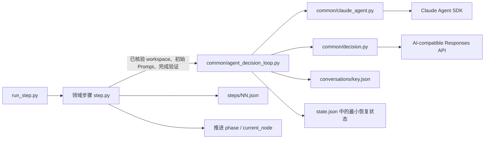
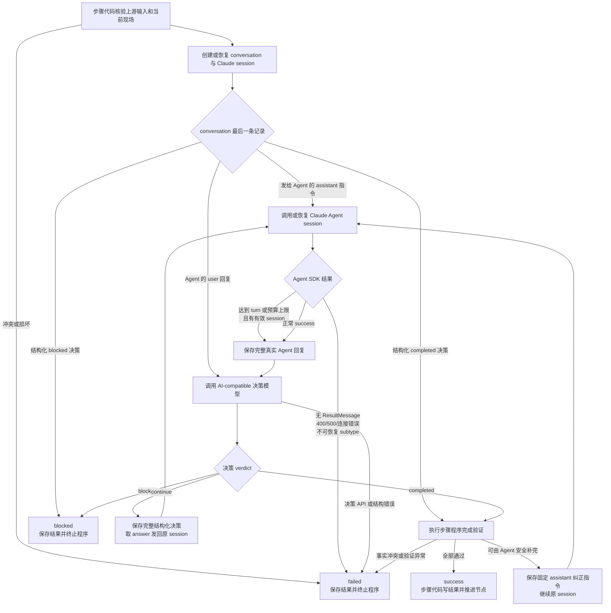
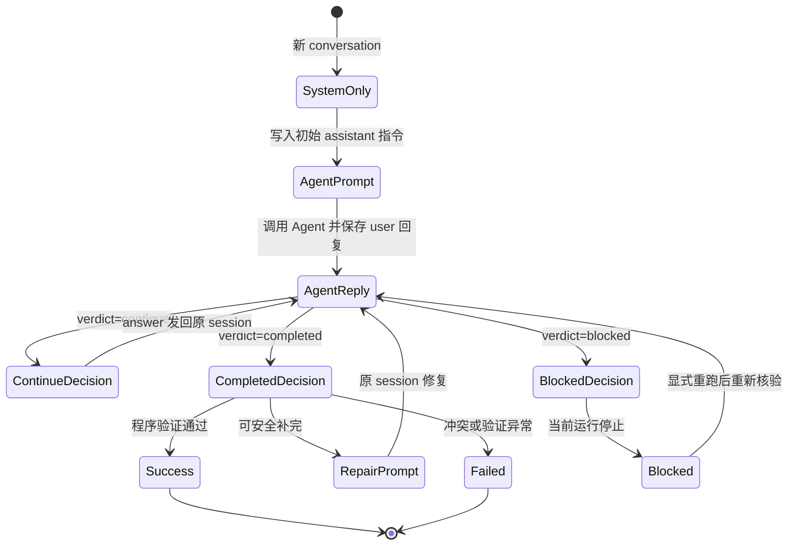

# PCM Demo 通用 Agent 决策对话循环 TRD

> 设计日期: 2026-08-22 
> 本文记录 PCM Demo 第 2、5、6、7、8 步已经实现的公共 Agent 决策对话循环技术合同。
>
> 本文只定义通用执行与恢复机制；各业务步骤的输入、产物、完成条件、Git 核验和状态推进仍以步骤 README、Demo 项目设计和活动 TRD 为准。

## 1. 背景与目标

第 2、5、6、7、8 步都需要完成同一种长任务交互：

```text
Claude Agent 执行领域任务
→ 保存完整回复
→ AI-compatible 模型判断是否完成
→ 将继续指令发回原 Claude session
→ 直到完成、阻塞或失败
```

旧实现分别维护 conversation、session、决策轮次、待发送 prompt 和完成标记，已经出现以下分叉：

- Agent 正常结束是否可以直接代表步骤完成；
- Agent 回复是否在调用决策模型前落盘；
- 决策与 Agent 调用之间中断后如何恢复；
- max-turn、max-budget、API 和连接错误如何分类；
- 步骤成功后使用什么事实作为幂等锚点；
- Agent 回复是否会被步骤代码改写。

本次实现目标：

1. 用一个薄公共循环统一 Agent、决策、持久化与恢复；
2. 每一轮都由决策模型明确返回 `completed / continue / blocked`；
3. `completed` 后必须经过步骤程序完成验证；
4. conversation 尾部成为下一动作的权威事实；
5. 保留各步骤的领域输入、Prompt、验证和状态推进职责；
6. 兼容既有 run，但不继续写旧协议字段。

## 2. 非目标

本次不建设：

- 通用工作流引擎或流程 DSL；
- 数据库、事件总线或分布式事务；
- 大型基类、继承体系或万能 Hook 协议；
- Git、测试、浏览器和文件验证 DSL；
- 多模型路由、凭据路由或成本策略；
- Agent 指令 exactly-once 投递；
- 外层无限重试、YAML 兼容解析或宽松 JSON 修复器。

PCM Demo 只采用文件、固定写入顺序和幂等重放完成恢复。

## 3. 总体架构



### 3.1 `common/claude_agent.py`

负责：

- 构造 `ClaudeAgentOptions`；
- 调用 Claude Agent SDK；
- 收集 init、AssistantMessage 和 ResultMessage；
- 返回 session、完整回复、终止语义、turn 数和成本；
- 保留 API status、terminal reason 和安全异常类型。

不负责：

- 读写 PCM 步骤状态；
- 判断领域产物；
- 决定步骤是否成功。

### 3.2 `common/decision.py`

负责：

- 定义统一 `AgentDecision`；
- 构造决策模型输入；
- 使用步骤提供的 decision system prompt；
- 统一附加严格 JSON 输出约束；
- 对结构化格式错误执行唯一一次重试；
- 解析新决定和兼容旧 `action` 记录。

### 3.3 `common/agent_decision_loop.py`

负责：

- conversation 读写和尾部状态解释；
- session、cwd、Skill、slash command 一致性检查；
- Agent 与决策模型交替；
- 决策轮次上限；
- `pending_agent_text` 恢复；
- blocked 显式重跑；
- SDK 结果分类和安全错误。

公共循环不导入 `steps.*`，不执行领域 Git、测试、浏览器或产物判断。第 8 步的多仓提交合同、`observed_heads` 和真实 Git verifier 均仍由该步骤实现，不形成公共 Git DSL。

### 3.4 各步骤 `step.py`

负责：

- 校验上游结果和当前现场；
- 生成 Agent 初始 Prompt；
- 定义领域 decision system prompt；
- 定义程序完成验证与 repair prompt；
- 将公共 blocked 结果映射为步骤异常；
- 写入 `steps/NN.json` 并推进下一节点。

## 4. 核心数据合同

### 4.1 `AgentDecision`

```text
verdict: completed | continue | blocked
answer: string
reason: string
required_inputs: string[]
```

字段约束：

| verdict | answer | required_inputs | 含义 |
|---|---|---|---|
| `completed` | 空 | 空 | Agent 回复表明领域任务已经完成 |
| `continue` | 非空 | 空 | 需要将明确指令发送回 Agent |
| `blocked` | 空 | 非空 | 缺少不可替代外部资源 |

`reason` 始终非空，用于记录裁决依据。

### 4.2 `AgentDecisionLoopSpec`

每个步骤提供一个不可变配置：

```text
key                    conversation 与 session 的领域键
state_key              步骤私有状态键
skill_name             必须实际加载的 Skill / slash command
max_decision_rounds     最大结构化决定数
max_turns               单次 Agent SDK turn 上限
max_budget_usd          单次 Agent SDK 成本上限
decision_system_prompt  当前领域完成判断条件
legacy_completion_messages  仅用于读取旧记录
```

### 4.3 `ClaudeRunResult`

公共循环使用的主要事实：

```text
init
text
result_subtype
is_error
session_id
stop_reason
num_turns
total_cost_usd
api_error_status
terminal_reason
has_errors
exception_type
```

Agent 回复 `text` 与 SDK/API 异常分开处理：前者完整保存，后者只持久化安全分类。

## 5. 完整决策流程



### 5.1 成功条件

最终成功必须同时满足：

1. Agent SDK 以正常 `success` 结束；
2. 决策模型返回 `completed`；
3. 步骤程序完成验证通过。

任何单项都不能独立代表步骤成功。

### 5.2 程序完成验证

步骤提供的 verifier 返回：

```text
None          当前完成事实通过
非空字符串    可由 Agent 安全补完的固定 repair prompt
抛出异常      状态、路径、Git 或交接冲突，步骤 failed
```

当 verifier 返回 repair prompt：

- 保留真实 `completed` JSON；
- 追加普通 `assistant` 修复指令；
- 恢复同一 Claude session；
- 等待下一轮 Agent 回复和新裁决。

旧 `completed` 因后继 repair prompt 不再位于 conversation 尾部，自然失去终止效力。

## 6. Conversation 尾部状态机

Conversation 文件：

```text
runs/<run-id>/conversations/<key>.json
```

角色约定：

- `system`：本次 run 实际使用的决策 system prompt；
- `assistant`：发给 Agent 的初始/继续/修复指令，或决策模型 JSON；
- `user`：Claude Agent SDK 返回的完整真实回复。



尾部恢复规则：

| conversation 尾部 | 下一动作 |
|---|---|
| `system` | 写入初始指令并调用 Agent |
| 普通 `assistant` | 将该指令发给 Agent |
| `user` | 请求决策，不重复调用 Agent |
| `continue` | 将 `answer` 发回原 session |
| `completed` | 重新执行程序完成验证 |
| `blocked` | 返回 blocked；显式重跑时重新核验外部条件 |

最终成功时 conversation 尾部就是 `completed`，不再追加 Python 固定完成声明。

## 7. 持久化与中断恢复

### 7.1 最小状态

```text
claude_sessions.<key>
decision_conversations.<key>.path
<state_key>.last_agent_result
<state_key>.pending_agent_text
```

不再新写：

- `pending_agent_prompt`；
- decision turn；
- `COMPLETION_MESSAGE`。

决策轮次直接从 conversation 中可解析的决定数计算。

### 7.2 Agent 回复写入时序

```mermaid
sequenceDiagram
    participant Step as 领域步骤
    participant Loop as 公共循环
    participant Agent as Claude Agent SDK
    participant State as state.json
    participant Conv as conversation.json
    participant Judge as 决策模型

    Step->>Loop: 已核验上下文 + 初始 Prompt + verifier
    Loop->>Conv: 先保存 assistant 指令
    Loop->>Agent: 调用或恢复 session
    Agent-->>Loop: init / ResultMessage / 完整回复
    Loop->>State: 保存 session、last_agent_result、pending_agent_text
    Loop->>Conv: 追加完整 user 回复
    Loop->>State: 清除 pending_agent_text
    Loop->>Judge: 发送完整 conversation
    Judge-->>Loop: AgentDecision JSON
    Loop->>Conv: 追加 assistant 决策
```

如果进程在 ResultMessage 与 conversation 写入之间中断：

1. `pending_agent_text` 已保存；
2. 重启后先把它补成 `user` 消息；
3. 再调用决策模型；
4. 不重复调用 Agent。

Prompt 投递采用 at-least-once 语义。恢复指令必须是幂等的“重新读取当前事实并继续”，不为 Demo 建设 exactly-once 协议。

## 8. Agent SDK 结果分类

| 结果 | 处理 |
|---|---|
| `success` + 正常 terminal reason | 保存完整回复并裁决 |
| `error_max_turns` / `error_max_budget_usd` + session + 回复 | 允许裁决，但必须恢复并取得后续正常 success |
| API 400/429/500 等 | `failed` |
| 无 ResultMessage | `failed` |
| CLI、连接、进程或协议异常 | `failed` |
| session/cwd/Skill/slash command 不一致 | `failed` |
| `aborted_streaming` / `aborted_tools` | `failed` |
| `success` 携带未知 terminal reason | `failed` |

已取得 max-turn/max-budget ResultMessage 后的尾随进程异常，不覆盖已经取得的可恢复结构化事实；其它异常不进入决策循环。

## 9. `blocked` 与 `failed`

### `blocked`

只用于当前环境无法取得的不可替代外部条件，例如：

- 外部账号或真实凭据；
- 客户私有数据或授权；
- 专用设备、付费服务或线下动作。

### `failed`

用于：

- 输入、状态、路径或交接错误；
- SDK、API、解析或程序错误；
- Git、文件或完成验证冲突；
- 唯一结构化重试后仍无法形成合法决定。

`blocked` 和 `failed` 都终止本次程序运行。`continue` 只存在于公共循环内部，不成为第四种步骤结果。

## 10. Prompt 合同

每个步骤分别维护：

1. Agent 初始 Prompt；
2. decision system prompt；
3. 程序 repair prompt。

统一要求：

- 首行 slash command 可显式选择当前能力；正文不写步骤编号、PCM 节点、阶段、session、轮次或 Skill 编排；
- 正文只写领域任务、权威输入、固定产物、真实验证与边界；
- 不复制 Skill 的完整执行流程；
- decision system prompt 只定义领域完成、继续和阻塞标准；
- repair prompt 只说明程序发现的固定缺口；
- JSON 格式约束由 `common/decision.py` 统一追加，不在每个步骤重复。

输入最小化：

- 第 5 步只传递 readiness 所需的选型投影；
- 第 6、7 步只传递白名单组装事实；
- 第 8 步只传递有序权威仓库清单与白名单组装事实，由该步骤而非公共循环核验每个 Git 事实；
- 不向 Prompt 传递 `git_url`、`origin` 或无关工程内容；
- 第 7 步只读取足以支撑方案主张的工程事实，不要求机械扫描整个代码库。

## 11. 完整回复与敏感信息

新 run 的 Agent 回复在以下位置保持完全一致：

- `pending_agent_text`；
- conversation 的 `user` 消息；
- 决策模型输入。

不进行后处理摘要或脱敏替换。run 目录由 Git 忽略。

该存储合同不代表允许 Agent 输出秘密：

- Agent Prompt 仍禁止主动展示秘密、完整 `.env` 或认证信息；
- SDK/API 异常只保存安全类型、status 和 terminal reason；
- 步骤错误、日志和用户输出不展示异常正文中的敏感值。

## 12. 步骤适配

| 步骤 | 初始领域任务 | 程序完成验证 |
|---|---|---|
| 2 `project-intake` | 收敛产品定义两件套 | 两份固定产品定义为非空普通文件 |
| 5 `project-readiness` | 核验进入项目化前的资源与配置 | 固定准备清单为非空普通文件 |
| 6 `project-bootstrap` | 有限项目化和真实工程验证 | 前序交接、根 README、工程和 Git 边界 |
| 7 `solution-design` | 基于真实工程形成总体技术方案 | 固定方案文档、前序交接和 Git 边界 |
| 8 `commit-changes` | 在同一产品根 session 中分别创建权威清单中各仓的唯一初始基线提交 | 步骤专属多仓 Git verifier、严格 marker、根 tree 与 `.gitignore` 边界 |

第 6 步没有适用基础工程时，继续 `applicable: false` 无副作用跳过，不调用 Agent 或决策模型。

## 13. 旧记录兼容

读取兼容：

- 旧 `action: blocked` → `blocked`；
- 旧其它 action → `continue`；
- 旧非阻塞 action 的空 `answer` → 固定安全继续提示；
- 旧 `{path, turn}` → 读取 path，轮次由 conversation 重算；
- 旧完成 sentinel → 重新执行程序完成验证；
- 旧 `pending_agent_prompt` → 丢弃，不重新发送。

兼容原则：

- 旧 conversation 不转换、不覆盖；
- 新 run 只写新 `verdict` 结构；
- 旧内部控制 JSON 不得作为普通 Prompt 发给 Agent；
- 已推进且步骤结果完整的 run 继续按幂等成功事实复用。

## 14. 验收与真实证据

自动化验证：

- 公共循环 23 项测试；
- 步骤测试共 85 项，其中第 8 步专属 14 项覆盖 root-only/三仓、单 Agent、repair、blocked 后部分提交恢复、最近观察 SHA、防 shallow、根 `.gitignore`、结果/state 中断和 CLI；
- 全量 108 项 `unittest`；
- `compileall`、`git diff --check` 和 IDE 诊断；
- 独立只读审查及两项问题修复复核。

兼容验证：

- `step01-mendmark` 只读核验通过；
- 旧 action、完成 sentinel 和 `{path, turn}` 均可读取；
- 黄金 run 未被修改，仍位于第 8 步入口。

真实集成验证：

- 隔离 run：`agent-loop-step7-20260822T190149Z`；
- 新 `solution_design` session 完成 init、错误现场保留和同 session 恢复；
- 真实 Agent 正常结束并生成技术方案；
- 决策服务经过严格 JSON 限定返回 `completed`；
- 隔离验证注入文档置空，触发固定 repair prompt；
- 原 session 补回文档并再次 `completed`；
- conversation 尾部为 `completed`，无旧 sentinel 或 `pending_agent_prompt`；
- 最终状态推进到 `project:08_initialize_repositories`。

第 8 步真实集成验证：

- `step08-real-20260823-a` 保留失败链路：第 1 步先后出现代码围栏、Responses `incomplete`、自创字段，收紧严格 JSON prompt 后同 run 成功；第 3 步一次 `ValidationError` 后同 run 重试成功；第 7 步 API 500 暴露 failed `07.json` 会错误阻断恢复，修复为仅 `status=success` 可复用后同 session 成功；第 8 步因未处理的模板 `.coverage`，Agent 未提交，决策模型重复索取调用方授权并耗尽 8 轮，未产生三仓提交。
- `step08-real-20260823-b` 第 6 步真实清除 `.coverage` 后完成第 8 步：唯一 session `64aa707c-268c-48c8-bb3f-f67f62abe75e` 的 conversation 为 `system → assistant → user → assistant`，一次 Agent 回复和一次 `completed` 裁决完成。root、frontend、backend 的唯一无父 `main` 提交依次为 `c1eb33dfa5bda91a0d7f9aeeb41d8fefe10a6fca`、`5997213c34c09ea6ba4e740e35f9df77d2d45d82`、`5d8dd95d8c42370697d25e6ecaf400bab42785b3`；三仓干净，根 tree 不含子仓，状态推进至 `project:09_engineering_architecture`。同 run 重跑不调用 Agent，SHA 不变。

Probe C：

- `probe-c-20260822T200038Z` 中普通决定为 `continue`、外部资源决定为 `blocked`，均一次解析成功；
- 此前重复调用曾出现非 JSON 和 `status=incomplete`；
- 当前实现严格返回 `failed`，不增加第三次重试或手写宽松解析；
- AI-compatible 服务重复稳定性继续作为正式 PCM 的验证输入。
