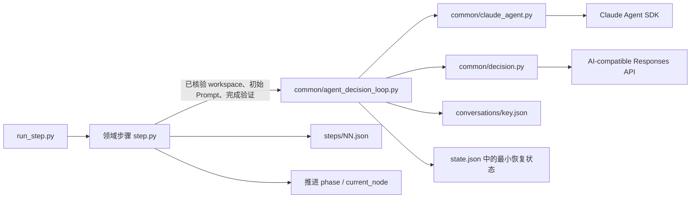
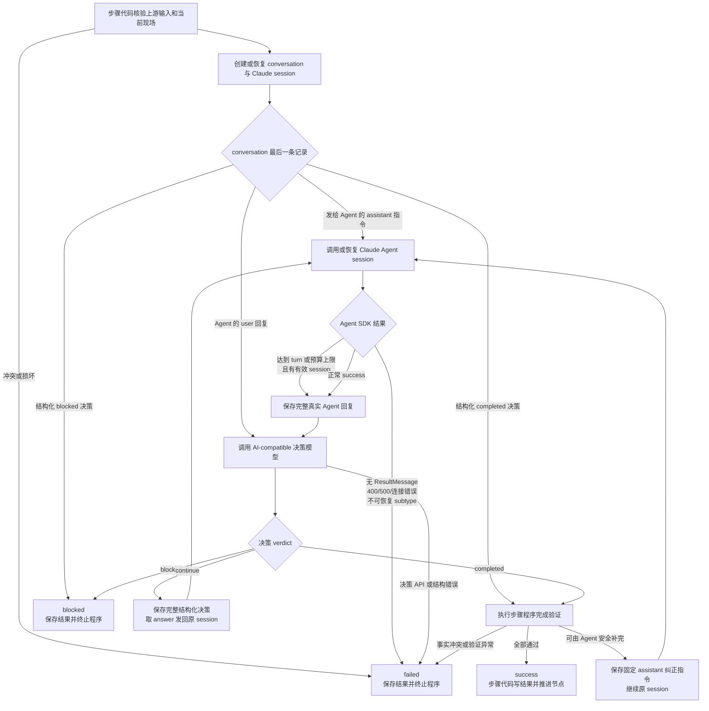
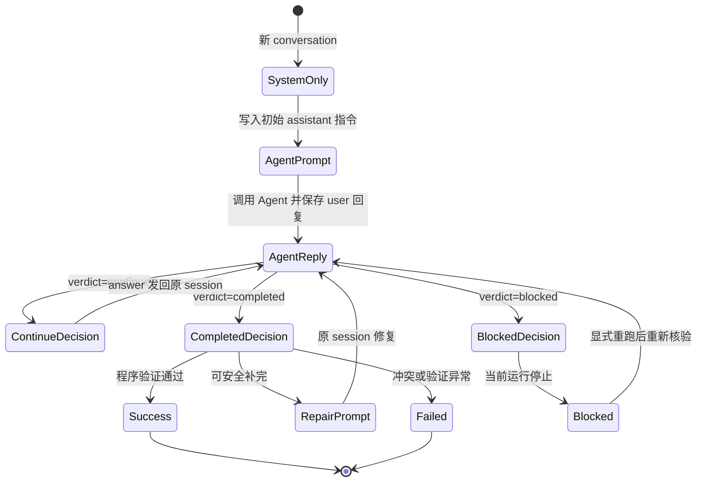

# PCM Demo 通用 Agent 决策对话循环 TRD

> 设计日期: 2026-08-22 
> 本文记录 PCM Demo 第 2、5、6、7、8、9 步已经实现的公共 Agent 决策对话循环技术合同。
>
> 本文只定义通用执行与恢复机制；各业务步骤的输入、产物、完成条件、Git 核验和状态推进仍以步骤 README、Demo 项目设计和活动 TRD 为准。

## 1. 背景与目标

第 2、5、6、7、8、9 步都需要完成同一种长任务交互：

```text
Claude Agent 执行领域任务
→ 保存完整回复
→ AI-compatible 模型判断是否完成
→ 将继续指令发回原 Claude session
→ 直到完成、阻塞或失败
```

旧实现分别维护 conversation、session、决策轮次、待发送 prompt 和完成标记，已经出现以下分叉：

- Agent 正常结束是否可以直接代表步骤完成；
- Agent 回复是否在调用决策模型前落盘；
- 决策与 Agent 调用之间中断后如何恢复；
- max-turn、max-budget、API 和连接错误如何分类；
- 步骤成功后使用什么事实作为幂等锚点；
- Agent 回复是否会被步骤代码改写。

本次实现目标：

1. 用一个薄公共循环统一 Agent、决策、持久化与恢复；
2. 每一轮都由决策模型明确返回 `completed / continue / blocked`；
3. `completed` 后必须经过步骤程序完成验证；
4. conversation 尾部成为下一动作的权威事实；
5. 保留各步骤的领域输入、Prompt、验证和状态推进职责；
6. 兼容既有 run，但不继续写旧协议字段。

## 2. 非目标

本次不建设：

- 通用工作流引擎或流程 DSL；
- 数据库、事件总线或分布式事务；
- 大型基类、继承体系或万能 Hook 协议；
- Git、测试、浏览器和文件验证 DSL；
- 多模型路由、凭据路由或成本策略；
- Agent 指令 exactly-once 投递；
- 外层无限重试、YAML 兼容解析或宽松 JSON 修复器。

PCM Demo 只采用文件、固定写入顺序和幂等重放完成恢复。

## 3. 总体架构



### 3.1 `common/claude_agent.py`

负责：

- 构造 `ClaudeAgentOptions`；
- 调用 Claude Agent SDK；
- 收集 init、AssistantMessage 和 ResultMessage；
- 返回 session、完整回复、终止语义、turn 数和成本；
- 保留 API status、terminal reason 和安全异常类型。

不负责：

- 读写 PCM 步骤状态；
- 判断领域产物；
- 决定步骤是否成功。

### 3.2 `common/decision.py`

负责：

- 定义统一 `AgentDecision`；
- 将统一角色、项目上下文、负责人职责、步骤完成条件和 Pydantic 输出合同分别渲染为新 conversation 的 `<role>`、`<project_context>`、`<responsibility>`、`<completion>`、`<output>` XML system prompt；
- 构造决策模型输入；
- 要求调用方显式传入该 system prompt，并原样传给一次 `responses.parse` 调用；
- 使用 Pydantic `AgentDecision` 取得结构化输出，不追加公共默认或隐藏格式 prompt，也不做格式重试。
- 解析新决定和兼容旧 `action` 记录。

### 3.3 `common/agent_decision_loop.py`

负责：

- conversation 读写和尾部状态解释；
- session、cwd、Skill、slash command 一致性检查；
- Agent 与决策模型交替；
- 决策轮次上限；
- `pending_agent_text` 恢复；
- blocked 显式重跑；
- SDK 结果分类和安全错误。

公共循环不导入 `steps.*`，不执行领域 Git、测试、浏览器或产物判断。第 8 步的权威多仓只读核验与干净基线逻辑、第 9 步的固定文档范围、只读 Git 核验和提交执行锚点均仍由各步骤实现，不形成公共 Git DSL 或通用提交抽象。

### 3.4 各步骤 `step.py`

负责：

- 校验上游结果和当前现场；
- 生成 Agent 初始 Prompt；
- 仅维护本步骤的领域 `DECISION_RULES`，并在调用公共循环前以已验证项目上下文生成动态 system snapshot；
- 定义程序完成验证与 repair prompt；
- 将公共 blocked 结果映射为步骤异常；
- 写入 `steps/NN.json` 并推进下一节点。

## 4. 核心数据合同

### 4.1 `AgentDecision`

```text
verdict: completed | continue | blocked
answer: string
reason: string
required_inputs: string[]
```

字段约束：

| verdict | answer | required_inputs | 含义 |
|---|---|---|---|
| `completed` | 空 | 空 | 负责人根据 Agent 的执行结果相信当前领域任务已完成，仍须通过步骤程序核验 |
| `continue` | 非空 | 空 | 需要将明确指令发送回 Agent |
| `blocked` | 空 | 非空 | 缺少不可替代外部资源 |

`reason` 始终非空，用于记录裁决依据。

### 4.2 `AgentDecisionLoopSpec`

每个步骤提供一个不可变配置：

```text
key                    conversation 与 session 的领域键
state_key              步骤私有状态键
skill_name             必须实际加载的 Skill / slash command
max_decision_rounds     最大结构化决定数
max_turns               单次 Agent SDK turn 上限
max_budget_usd          单次 Agent SDK 成本上限
decision_system_prompt 由统一渲染器生成的完整 system snapshot
legacy_completion_messages  仅用于读取旧记录
```

### 4.3 `ClaudeRunResult`

公共循环使用的主要事实：

```text
init
text
result_subtype
is_error
session_id
stop_reason
num_turns
total_cost_usd
api_error_status
terminal_reason
has_errors
exception_type
```

Agent 回复 `text` 与 SDK/API 异常分开处理：前者完整保存，后者只持久化安全分类。

## 5. 完整决策流程



### 5.1 成功条件

最终成功必须同时满足：

1. Agent SDK 以正常 `success` 结束；
2. 决策模型返回 `completed`；
3. 步骤程序完成验证通过。

任何单项都不能独立代表步骤成功。

### 5.2 程序完成验证

步骤提供的 verifier 返回：

```text
None          当前完成事实通过
非空字符串    可由 Agent 安全补完的固定 repair prompt
抛出异常      状态、路径、Git 或交接冲突，步骤 failed
```

当 verifier 返回 repair prompt：

- 保留真实 `completed` JSON；
- 追加普通 `assistant` 修复指令；
- 恢复同一 Claude session；
- 等待下一轮 Agent 回复和新裁决。

旧 `completed` 因后继 repair prompt 不再位于 conversation 尾部，自然失去终止效力。

## 6. Conversation 尾部状态机

Conversation 文件：

```text
runs/<run-id>/conversations/<key>.json
```

角色约定：

- `system`：新 conversation 保存的动态 system snapshot；恢复时严格读取历史 `messages[0]`，不重渲染或覆盖；
- `assistant`：实际使用 Claude Code Agent 的项目负责人、工程负责人和 Agent 专家发给 Agent 的初始、继续或修复指令，或该负责人每轮返回的 `AgentDecision` JSON；
- `user`：Claude Agent SDK 返回的完整真实 Agent 回复。



尾部恢复规则：

| conversation 尾部 | 下一动作 |
|---|---|
| `system` | 写入初始指令并调用 Agent |
| 普通 `assistant` | 将该指令发给 Agent |
| `user` | 请求决策，不重复调用 Agent |
| `continue` | 将 `answer` 发回原 session |
| `completed` | 重新执行程序完成验证 |
| `blocked` | 返回 blocked；显式重跑时重新核验外部条件 |

最终成功时 conversation 尾部就是 `completed`，不再追加 Python 固定完成声明。

## 7. 持久化与中断恢复

### 7.1 最小状态

```text
claude_sessions.<key>
decision_conversations.<key>.path
<state_key>.last_agent_result
<state_key>.pending_agent_text
```

不再新写：

- `pending_agent_prompt`；
- decision turn；
- `COMPLETION_MESSAGE`。

决策轮次直接从 conversation 中可解析的决定数计算。

### 7.2 Agent 回复写入时序

```mermaid
sequenceDiagram
    participant Step as 领域步骤
    participant Loop as 公共循环
    participant Agent as Claude Agent SDK
    participant State as state.json
    participant Conv as conversation.json
    participant Judge as 决策模型

    Step->>Loop: 已核验上下文 + 初始 Prompt + verifier
    Loop->>Conv: 先保存 assistant 指令
    Loop->>Agent: 调用或恢复 session
    Agent-->>Loop: init / ResultMessage / 完整回复
    Loop->>State: 保存 session、last_agent_result、pending_agent_text
    Loop->>Conv: 追加完整 user 回复
    Loop->>State: 清除 pending_agent_text
    Loop->>Judge: 发送完整 conversation
    Judge-->>Loop: AgentDecision JSON
    Loop->>Conv: 追加 assistant 决策
```

如果进程在 ResultMessage 与 conversation 写入之间中断：

1. `pending_agent_text` 已保存；
2. 重启后先把它补成 `user` 消息；
3. 再调用决策模型；
4. 不重复调用 Agent。

Prompt 投递采用 at-least-once 语义。恢复指令必须是幂等的“重新读取当前事实并继续”，不为 Demo 建设 exactly-once 协议。

## 8. Agent SDK 结果分类

| 结果 | 处理 |
|---|---|
| `success` + 正常 terminal reason | 保存完整回复并裁决 |
| `error_max_turns` / `error_max_budget_usd` + session + 回复 | 允许裁决，但必须恢复并取得后续正常 success |
| API 400/429/500 等 | `failed` |
| 无 ResultMessage | `failed` |
| CLI、连接、进程或协议异常 | `failed` |
| session/cwd/Skill/slash command 不一致 | `failed` |
| `aborted_streaming` / `aborted_tools` | `failed` |
| `success` 携带未知 terminal reason | `failed` |

已取得 max-turn/max-budget ResultMessage 后的尾随进程异常，不覆盖已经取得的可恢复结构化事实；其它异常不进入决策循环。

## 9. `blocked` 与 `failed`

### `blocked`

只用于当前环境无法取得的不可替代外部条件，例如：

- 外部账号或真实凭据；
- 客户私有数据或授权；
- 专用设备、付费服务或线下动作。

### `failed`

用于：

- 输入、状态、路径或交接错误；
- SDK、API、解析或程序错误；
- Git、文件或完成验证冲突；
- 无法形成合法结构化决定。

`blocked` 和 `failed` 都终止本次程序运行。`continue` 只存在于公共循环内部，不成为第四种步骤结果。

## 10. Prompt 合同

每个步骤分别维护：

1. Agent 初始 Prompt；
2. 领域 `DECISION_RULES`；
3. 程序 repair prompt。

`common/decision.py` 仅在新 conversation 创建时，将统一负责人角色、已验证项目上下文、统一职责、该步骤领域完成条件和 Pydantic 输出合同分别渲染为完整 XML system snapshot；公共循环首次保存该 snapshot。恢复已有历史时严格使用 `messages[0]`，不依据当前文件重新渲染或覆盖历史。

统一要求：

- snapshot 的 XML 标签严格为 `<role>`、`<project_context>`、`<responsibility>`、`<completion>`、`<output>`；步骤 `DECISION_RULES` 只进入 completion，不与统一职责混写；output 明确 `completed` 的 `answer`/`required_inputs` 均为空、`continue` 的 `answer` 非空且 `required_inputs` 为空、`blocked` 的 `answer` 为空且 `required_inputs` 非空，并要求所有 `reason` 非空；
- AI-compatible 角色是实际使用 Claude Code Agent 的项目负责人、工程负责人、专业开发者和 Agent 专家，`assistant` 是其此前发给 Agent 的指令或结构化回复，`user` 是 Agent 返回的完整执行结果；
- `completed` 只表示负责人根据 Agent 执行结果相信当前任务完成，步骤程序仍以现有文件、Git、命令和交接 verifier 二次核验；
- 首行 slash command 只属于 Agent initial prompt；该 prompt 正文不写步骤编号、PCM 节点、阶段、session 或 Skill 编排；
- `request_decision` 的 system prompt 为必传参数，并原样传给一次 `responses.parse`；Pydantic `AgentDecision` 是唯一结构化输出合同，没有公共默认 system prompt、公共 JSON 追加 prompt 或格式重试；
- 项目上下文范围固定为：第 2 步初稿原文和目标路径；第 5 步产品定义原文、适用工程、选型白名单投影及资源清单仅路径/可读性；第 6、7 步产品定义原文、准备清单原文、适用工程和组装白名单投影；第 8 步有序权威仓库相对路径和干净基线说明；第 9 步两份产品定义原文、准备清单原文、总体技术方案原文、有序权威工程与固定输出路径；第 8、9 步其余只读 Git 核验与 verifier 仍由步骤私有实现；
- 选型和组装投影不包含 `git_url`、`origin`、`remote`。资源清单正文和 `.env` 不进入项目上下文；资源清单仍按步骤 Agent initial prompt 的既有授权处理；
- 项目上下文只做标准 XML 转义；
- repair prompt 只说明程序发现的固定缺口。

## 11. 完整回复与输入边界

新 run 的 Agent 回复在以下位置保持完全一致：

- `pending_agent_text`；
- conversation 的 `user` 消息；
- 决策模型输入。

不进行后处理摘要或脱敏替换。run 目录由 Git 忽略。

资源清单正文和 `.env` 因输入来源边界不进入决策项目上下文。SDK/API 异常仍只保存类型、status 和 terminal reason。

## 12. 步骤适配

| 步骤 | 初始领域任务 | 程序完成验证 |
|---|---|---|
| 2 `project-intake` | 收敛产品定义两件套 | 两份固定产品定义为非空普通文件 |
| 5 `project-readiness` | 核验进入项目化前的资源与配置 | 固定准备清单为非空普通文件 |
| 6 `project-bootstrap` | 有限项目化和真实工程验证 | 前序交接、根 README、工程和 Git 边界 |
| 7 `solution-design` | 基于真实工程形成总体技术方案 | 固定方案文档、前序交接和 Git 边界 |
| 8 `commit-changes` | 对权威仓库清单形成首次全仓干净基线；已全干净时零调用，dirty 时同一产品根 session 处理必要提交 | 步骤专属多仓 top-level、`main` 与工作树只读核验 |
| 9 `engineering-architecture` / `commit-changes` | 必须基于固定权威输入形成工程架构文档；文档完成后在同一 session 固定调用一次提交核验，即使文档无变化也不跳过该调用 | 固定文档非空且 tracked、提交 prompt 后紧邻非空 Agent 回复、原 session、全体权威仓库自身 top-level / `main` / clean |

第 6 步没有适用基础工程时，继续 `applicable: false` 无副作用跳过，不调用 Agent 或决策模型。第 9 步始终 `applicable: true`，不存在简单项目跳过或不适用结果；第 10 步仍按需。

## 13. 旧记录兼容

读取兼容：

- 旧 `action: blocked` → `blocked`；
- 旧其它 action → `continue`；
- 旧非阻塞 action 的空 `answer` → 固定安全继续提示；
- 旧 `{path, turn}` → 读取 path，轮次由 conversation 重算；
- 旧完成 sentinel → 重新执行程序完成验证；
- 旧 `pending_agent_prompt` → 丢弃，不重新发送。

兼容原则：

- 旧 conversation 不转换、不覆盖；
- 新 run 只写新 `verdict` 结构；
- 旧内部控制 JSON 不得作为普通 Prompt 发给 Agent；
- 已推进且步骤结果完整的 run 继续按幂等成功事实复用；
- `run_step.py` 只对 schema 完整的第 8、9 步 success 保护既有 result 和已经推进的 state；后续重跑失败不会覆盖 success 或回退节点，字段残缺的 success 不保护，其它步骤维持原有入口行为。

## 14. 验收与真实证据

自动化验证：

- 第 9 步专属 29 项、公共循环 24 项、第 7 步 8 项、第 8 步 17 项；
- 第 7/8/9 步与公共循环相关定向测试 78 项（8+17+29+24）；
- 全量 141 项 `unittest`；
- `compileall`、`git diff --check` 均已通过；IDE 对第 9 步无诊断。本轮文档更新后的最终审查由主代理执行。

兼容验证：

- 旧 action、完成 sentinel 和 `{path, turn}` 均可读取；
- 旧 `step08-real-20260823-a/b` 继续按旧“唯一初始提交证明”合同解释，不改写为当前合同证据；
- 真实 run `step01-mendmark` 的目录名与 state 内历史 `run_id` 不一致是既有已知事实；当前第 8 步依据 state、产品路径和现场继续核验并已推进到第 9 步入口。

真实集成验证：

- Git 忽略 run `prompt-role-replay-20260823` 保留旧四段 XML system snapshot 的历史回放，不再作为现行五段 prompt 证据；现行 prompt 已由第 9 步 fresh 真实运行验证。
- 首次尝试复用旧隔离第 7 步工作区时，在请求 API 前因不满足现行第 4 步 Git 元数据合同停止；最终改用现行交接事实回放，不将该前置停止记录为失败 run。
- 隔离 run：`agent-loop-step7-20260822T190149Z`；
- 新 `solution_design` session 完成 init、错误现场保留和同 session 恢复；
- 真实 Agent 正常结束并生成技术方案；
- 决策服务曾在旧格式约束下返回 `completed`；该历史不证明现行 XML prompt；
- 隔离验证注入文档置空，触发固定 repair prompt；
- 原 session 补回文档并再次 `completed`；
- conversation 尾部为 `completed`，无旧 sentinel 或 `pending_agent_prompt`；
- 最终状态推进到 `project:08_initialize_repositories`。

第 8 步旧合同真实运行：

- `step08-real-20260823-a` 保留旧“唯一初始提交证明”合同下的失败链路：第 1 步先后出现代码围栏、Responses `incomplete`、自创字段，收紧严格 JSON prompt 后同 run 成功；第 3 步一次 `ValidationError` 后同 run 重试成功；第 7 步 API 500 暴露 failed `07.json` 会错误阻断恢复，修复为仅 `status=success` 可复用后同 session 成功；第 8 步因未处理的模板 `.coverage`，Agent 未提交，决策模型重复索取调用方授权并耗尽 8 轮，未产生三仓提交。
- `step08-real-20260823-b` 是旧合同下的历史成功：第 6 步真实清除 `.coverage` 后，session `64aa707c-268c-48c8-bb3f-f67f62abe75e` 的 conversation 为 `system → assistant → user → assistant`，一次 Agent 回复和一次 `completed` 裁决完成。root、frontend、backend 的唯一无父 `main` 提交依次为 `c1eb33dfa5bda91a0d7f9aeeb41d8fefe10a6fca`、`5997213c34c09ea6ba4e740e35f9df77d2d45d82`、`5d8dd95d8c42370697d25e6ecaf400bab42785b3`；状态推进至 `project:09_engineering_architecture`。这些 SHA、提交形态和重跑事实不再是当前合同完成条件。

第 8 步当前合同真实运行：

- 真实 run 目录为 `pcm-demo/runs/step01-mendmark`，state 内历史 `run_id` 不一致是既有已知事实；产品工作区为 `/Users/zhou/resource/fireworks/ANDRSZAN/pcm-products/mendmark`。权威仓库为 `root/frontend/backend`，第 4 步 `outputs` 为 `frontend/backend`；首次执行前三仓均为自身 top-level、`main`、dirty 且 HEAD 不存在。
- 首次执行只创建 `initialize_repositories` session `f6d42df8-13e5-437b-ada3-eef1015ecc87`。Agent 尝试内置 Explore 时遇到环境未识别模型 `gpt-5.6-sol[1m]`，无 Result、无 Git 变化，进程挂起后停止；session、conversation 和 init 证据已保存。这是环境内部子代理问题，不是第 8 步业务或 Git 逻辑失败。
- 仅在该 Git 忽略 run 历史中追加普通恢复指令“不要使用子代理/Explore，直接工具完成”，生产 prompt 和代码未改变；重跑恢复同一 session。Agent 先创建 frontend `dbab574dbe4d83a02323a750afd04de007565ac5` 和 backend `9682be837759c20f1a9ebbdf8fa2cfc09c2768d4` 两个本地提交，未 push，随后针对根仓运行时产物和 `.agents/plugins/superpowers/.git` 请求决策。
- AI-compatible 负责人返回 `continue`：删除 61 个 `.in_use/*`、`.orphaned_at`、`.coverage` 运行时产物、补 `.gitignore`、移除 superpowers 嵌套 `.git` 并按普通受控插件快照提交，不采用 submodule。同一 session 继续后，root 创建 `02ba4c1`（产品与技术基线）、`ae72c31`（Agent 规范与 Skills）、`5eeeacd217bbd27e03483b1b6d32915c721aadd9`（插件快照）三个本地提交，未 push。
- 最终 conversation 共 7 条，角色顺序为 `system → assistant 初始 → assistant 恢复 → user → assistant continue → user → assistant completed`。Agent 最终正常 `success`，26 turns，约 `$1.859406`，session 不变。
- Python 只读 verifier 写入 `steps/08.json` success：`applicable_repositories` 为 `root/frontend/backend`，result 保存相对路径，state 保存绝对路径，并推进到 `project:09_engineering_architecture`。独立 Git 核验确认 root HEAD `5eeeacd217bbd27e03483b1b6d32915c721aadd9`、3 commits，frontend HEAD `dbab574dbe4d83a02323a750afd04de007565ac5`、1 commit，backend HEAD `9682be837759c20f1a9ebbdf8fa2cfc09c2768d4`、1 commit；三仓均在 `main` 且 `status --porcelain` 为空。这证明当前合同允许每仓 0、1 或多个提交，不要求唯一无父提交。
- 同 run 重跑第 8 步直接 clean 幂等成功，conversation 仍为 7 条，未再次调用 Agent 或决策模型，SHA 不变。backend 提交阶段 Agent 摘要报告 Ruff、格式、build 通过，`pytest` 14 passed、1 skipped，跳过项需要显式 `DB_*`；该摘要不是 Python verifier 条件，也不改变第 6 步历史项目化验证。
- 当前合同已完成真实 Agent 集成验证，但首次成功包含 run-local 恢复指令，不能宣称环境内部子代理问题已经解决或无需恢复。

第 9 步当前合同与真实运行：

- 第 9 步是必要步骤，固定输入为第 2 步两份产品定义、第 5 步准备清单、第 7 步总体技术方案和第 8 步权威仓库 clean 交接；固定输出为 `docs/design/工程架构设计.md`。单一公共 conversation/session 键为 `engineering_architecture`，初始调用 `/engineering-architecture`。
- fresh 入口先要求全仓 clean；执行期间子仓必须持续 clean，根仓只允许固定文档 dirty，请求任何负责人决定前都再次核验。completion verifier 在文档非空后固定发送一次 `/commit-changes` repair，并恢复原 session；即使文档无变化也必须调用一次。
- 提交执行锚点接受任意固定 commit prompt 后紧邻非空 `user` 回复且 session 为原 session，不要求它是最后一个 user 之前的 prompt，也不强制领域与提交固定拆轮。commit-changes 执行轮可以在发现文档矛盾时严格不修改并报告；外层负责人后续可通过普通 `continue` 限定通用 Agent 只修正固定文档并提交。
- Python 只读 Git，仅核验 top-level、`main`、全仓与固定文档 status、固定文档 tracked；不读取 HEAD、SHA、提交数或历史。最终要求文档非空、tracked，全体权威仓库各自 top-level、`main`、clean。fresh 预置执行历史、恢复锚点缺失、conversation 叶文件或父目录符号链接均拒绝；成功推进 `project:10_ui_ux_framework`。第 10 步仍按需。
- 旧失败历史包括 free quota / `use free tier only` 导致的 HTTP 403、访问恢复后的非 JSON 普通文本，以及 `completed` 携带非空 `answer`。根因是旧 prompt 将步骤规则混入 responsibility、硬编码并重复 completion 语义且缺少 output。用户将其重构为 `role/project_context/responsibility/completion/output` 五段，补齐 f-string JSON 花括号转义和 `AgentDecision` 字段组合约束，并同步 common 与第 2/5/6/7/9 步测试。
- 按用户要求两次清理第 9 步局部 result、conversation、session、private state 和失败生成的未跟踪文档后，保留第 0～8 步历史与三仓提交执行 fresh 运行。最终唯一 session `f41fc439-4c46-434f-b3e9-d15c18c89601`，conversation 共 11 条：`system → assistant 初始 → user → assistant continue → user → assistant completed → assistant commit prompt → user → assistant continue → user → assistant completed`。
- 首轮 Agent 请求确认，负责人合法 `continue` 后 Agent 创建约 32 KB 固定文档，只有根仓固定文档 dirty；负责人 `completed` 后 verifier 同 session 发送 `/commit-changes`。该 Skill 发现文档中的 frontend Git 事实矛盾，严格未修改、未暂存、未提交并报告；外层负责人随后普通 `continue` 授权通用 Agent 仅修正文档并精确提交。
- 产品根提交 `ead14dffe19bc6417634c24c7bb1103602c3b772`，message `docs: 新增工程架构设计`，仅新增 `docs/design/工程架构设计.md`，376 行、32928 字节；未 push，frontend/backend 无变化。最终 decision 为合法严格 JSON `completed`，`steps/09.json` success，state success 并推进到 `project:10_ui_ux_framework`。
- 独立核验 root/frontend/backend 均为自身 top-level、`main`、clean，固定文档 tracked。同 run 幂等重跑后 conversation 仍为 11 条，session 和 root HEAD 不变，没有 Agent、decision 或新提交调用。

Probe C：

- `probe-c-20260822T200038Z` 等 Probe C 结果保留为旧格式合同历史；
- 现行实现使用五段 XML system prompt、一次 `responses.parse` 和 Pydantic `AgentDecision`，没有公共格式重试或隐藏追加 prompt；该合同已由第 9 步 fresh 真实运行验证。
